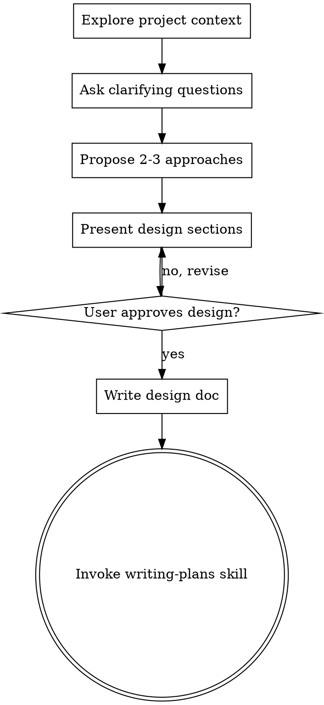

# 头脑风暴：将想法转化为设计

## 概述

通过自然的协作对话，帮助将想法转化为完整的设计和规格说明。

首先了解当前项目的上下文，然后逐一提问以完善想法。一旦你理解了要构建什么，就展示设计方案并获得用户批准。

<HARD-GATE>
在你展示设计方案并获得用户批准之前，不要调用任何实现相关的 skill，不要编写任何代码，不要搭建任何项目框架，也不要采取任何实现行动。无论项目看起来多么简单，这一规则都适用于每一个项目。
</HARD-GATE>

## 反模式："这个太简单了，不需要设计"

每个项目都要经过这个流程。无论是一个待办列表、一个单函数工具还是一个配置修改——所有项目都是如此。"简单"的项目恰恰是未经审视的假设造成最多浪费的地方。设计可以很简短（对于真正简单的项目只需几句话），但你必须展示设计方案并获得批准。

## 检查清单

你必须为以下每个条目创建一个任务，并按顺序完成：

1. **探索项目上下文** — 检查文件、文档、最近的提交
2. **提出澄清问题** — 一次一个，理解目的/约束/成功标准
3. **提出 2-3 种方案** — 包含权衡分析和你的推荐
4. **展示设计方案** — 各部分按其复杂度进行展开，每个部分完成后获得用户批准
5. **编写设计文档** — 保存到 `docs/specs/yyyy-MM-dd-REQ-{id}/{topic}/design.md` 并提交
6. **过渡到实现** — 调用 writing-plans skill 创建实现计划

## 流程图

**终态是调用 writing-plans。** 不要调用 frontend-design、mcp-builder 或任何其他实现 skill。头脑风暴之后你唯一应该调用的 skill 是 writing-plans。

## 流程详解

**理解想法：**
- 首先查看当前项目状态（文件、文档、最近的提交）
- 逐一提问以完善想法
- 尽可能使用选择题，开放式问题也可以
- 每条消息只提一个问题——如果某个主题需要更多探讨，就拆分成多个问题
- 重点理解：目的、约束、成功标准

**探索方案：**
- 提出 2-3 种不同的方案及其权衡
- 以对话方式呈现选项，附上你的推荐和理由
- 先展示你推荐的方案并解释原因

**展示设计：**
- 一旦你认为自己理解了要构建的内容，就展示设计方案
- 每个部分按其复杂度调整篇幅：简单的用几句话，复杂的最多 200-300 字
- 每个部分结束后询问目前看起来是否正确
- 涵盖：架构、组件、数据流、错误处理、测试
- 准备好在有不清楚的地方时回头澄清

## 设计之后

**REQ-id 确认：**
- 检查 `docs/specs/` 中最近的 `yyyy-MM-dd-REQ-{id}` 目录
- 向用户展示找到的 REQ-id 以确认
- 如果没有找到现有的 REQ-id 目录，请用户提供一个
- 为此设计确定一个简短的英文主题名称

**文档编写：**
- 将验证通过的设计写入 `docs/specs/yyyy-MM-dd-REQ-{id}/{topic}/design.md`
- 如果可用，使用 elements-of-style:writing-clearly-and-concisely skill
- 将设计文档提交到 git

**实现：**
- 调用 writing-plans skill 创建详细的实现计划
- 不要调用任何其他 skill。writing-plans 是下一步。

## 关键原则

- **一次一个问题** - 不要一次抛出多个问题
- **优先选择题** - 在可能的情况下，比开放式问题更容易回答
- **严格遵循 YAGNI** - 从所有设计中移除不必要的功能
- **探索替代方案** - 在确定方案之前始终提出 2-3 种方案
- **增量验证** - 展示设计，获得批准后再继续
- **保持灵活** - 有不清楚的地方就回头澄清
