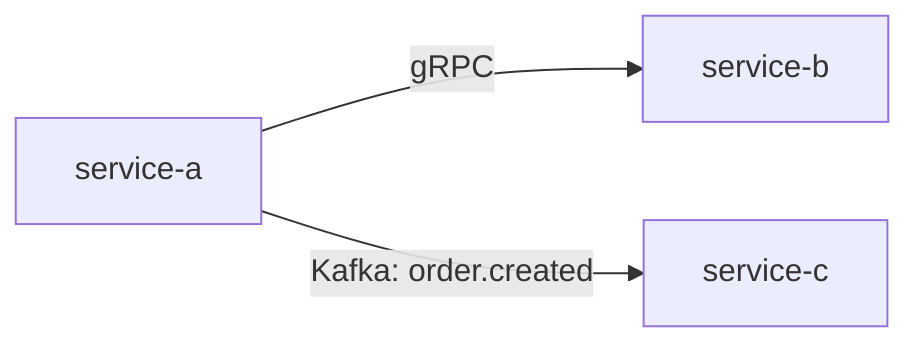

# 高层设计: {标题}

> REQ-{id}

## 1. 系统概览
- 业务背景与目标
- 系统边界图（哪些 service 在范围内）

## 2. Service 职责划分

| Service | 职责 | Owner |
|---------|------|-------|
| service-a | ... | ... |
| service-b | ... | ... |

## 3. 接口与事件契约

### 3.1 同步接口 (API)

| Provider | Consumer | 接口 | 描述 |
|----------|----------|------|------|

### 3.2 异步事件

| Producer | Consumer | Event | 描述 |
|----------|----------|-------|------|

## 4. 依赖关系图

- 依赖方向与理由说明

## 5. 数据归属

| 数据实体 | 归属 Service | 消费方 |
|----------|-------------|--------|

## 6. 部署与基础设施约束
- 是否需要新增基础设施？
- 跨地域/跨集群考虑？

## 7. 风险与待定事项

| 风险 | 影响 | 缓解策略 |
|------|------|----------|
