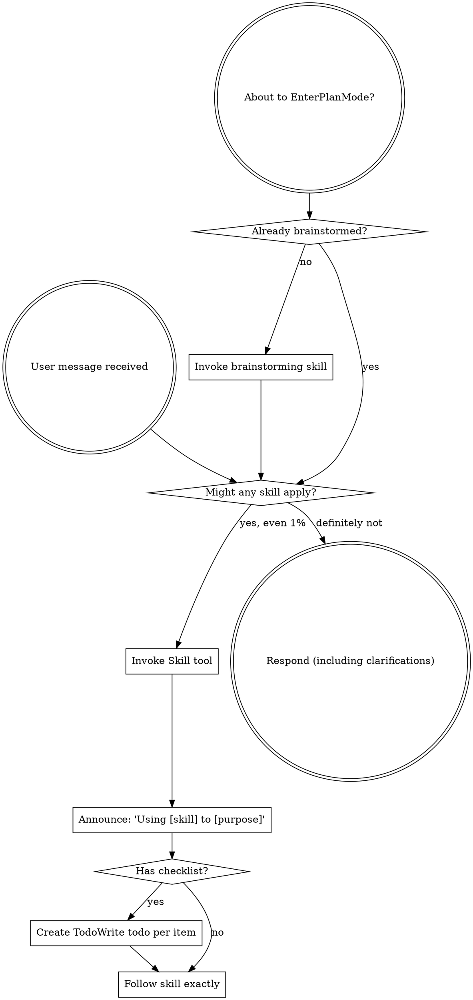

<EXTREMELY-IMPORTANT>
如果你认为某个 skill 哪怕只有 1% 的可能性适用于你正在做的事情，你绝对必须调用该 skill。

如果一个 skill 适用于你的任务，你没有选择。你必须使用它。

这不可商量。这不是可选的。你不能为此找理由。
</EXTREMELY-IMPORTANT>

## 如何访问 Skill

**在 Claude Code 中：** 使用 `Skill` 工具。当你调用一个 skill 时，它的内容会被加载并呈现给你——直接遵循它。不要使用 Read 工具读取 skill 文件。

**在其他环境中：** 查看你的平台文档了解 skill 是如何加载的。

# 使用 Skill

## 规则

**在任何回复或操作之前，先调用相关或被请求的 skill。** 即使只有 1% 的可能性某个 skill 适用，你也应该调用该 skill 来检查。如果调用后发现该 skill 不适合当前情况，你不需要使用它。

## 危险信号

以下想法意味着停下——你在自我合理化：

| 想法 | 现实 |
|------|------|
| "这只是一个简单的问题" | 问题也是任务。检查 skill。 |
| "我需要先了解更多上下文" | Skill 检查在澄清问题之前进行。 |
| "让我先探索一下代码库" | Skill 告诉你如何探索。先检查。 |
| "我可以快速查看一下 git/文件" | 文件缺少对话上下文。检查 skill。 |
| "让我先收集一些信息" | Skill 告诉你如何收集信息。 |
| "这不需要正式的 skill" | 如果 skill 存在，就使用它。 |
| "我记得这个 skill" | Skill 会演化。读取当前版本。 |
| "这不算一个任务" | 操作 = 任务。检查 skill。 |
| "这个 skill 小题大做了" | 简单的事情会变复杂。使用它。 |
| "我先做这一件事" | 做任何事之前先检查。 |
| "这感觉很有效率" | 缺乏纪律的操作浪费时间。Skill 防止这种情况。 |
| "我知道那是什么意思" | 知道概念 ≠ 使用 skill。调用它。 |

## Skill 优先级

当多个 skill 可能适用时，使用以下顺序：

1. **先使用流程类 skill**（brainstorming、debugging）- 这些决定如何处理任务
2. **再使用实现类 skill**（frontend-design、mcp-builder）- 这些指导执行

"让我们构建 X" → 先 brainstorming，再使用实现类 skill。
"修复这个 bug" → 先 debugging，再使用领域相关 skill。

## Skill 类型

**严格型**（TDD、debugging）：严格遵循。不要因为"灵活"而降低纪律。

**灵活型**（模式类）：根据上下文调整原则。

Skill 本身会告诉你它属于哪种类型。

## 用户指令

指令说的是做什么，而不是怎么做。"添加 X"或"修复 Y"不意味着跳过工作流。
