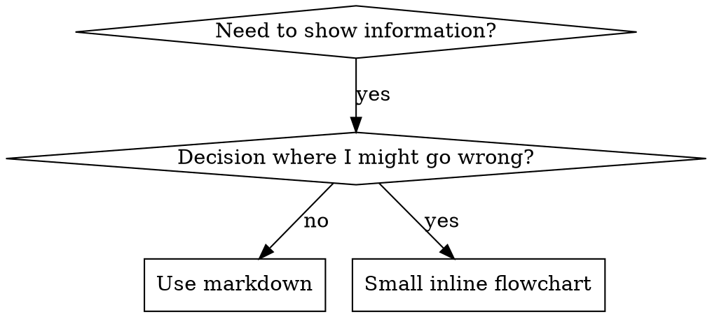

# 编写技能

## 概述

**编写技能就是将测试驱动开发应用于流程文档。**

**个人技能存放在 agent 特定目录中（Claude Code 用 `~/.claude/skills`，Codex 用 `~/.agents/skills/`）**

你编写测试用例（使用 sub-agent 的压力场景），观察失败（基线行为），编写技能（文档），观察通过（agent 遵守），然后重构（封堵漏洞）。

**核心原则：** 如果你没有观察到 agent 在没有该技能的情况下失败，你就不知道该技能教的是否正确。

**必要前置知识：** 使用本技能之前你必须理解 superpowers:test-driven-development。该技能定义了基本的 RED-GREEN-REFACTOR 循环。本技能将 TDD 改编应用于文档。

**官方指南：** 关于 Anthropic 官方的技能编写最佳实践，参见 anthropic-best-practices.md。该文档提供了补充本技能中 TDD 导向方法的额外模式和指南。

## 什么是技能？

**技能**是经验证的技术、模式或工具的参考指南。技能帮助未来的 Claude 实例找到并应用有效方法。

**技能是：** 可复用的技术、模式、工具、参考指南

**技能不是：** 关于你如何解决某个问题的叙事

## TDD 映射到技能

| TDD 概念 | 技能创建 |
|----------|---------|
| **测试用例** | 使用 sub-agent 的压力场景 |
| **生产代码** | 技能文档（SKILL.md） |
| **测试失败（RED）** | Agent 在没有技能的情况下违反规则（基线） |
| **测试通过（GREEN）** | Agent 在技能存在时遵守规则 |
| **重构** | 封堵漏洞同时保持合规 |
| **先写测试** | 编写技能之前先运行基线场景 |
| **观察失败** | 记录 agent 使用的具体合理化借口 |
| **最小代码** | 编写针对那些特定违规的技能 |
| **观察通过** | 验证 agent 现在遵守了 |
| **重构循环** | 发现新的合理化借口 → 封堵 → 重新验证 |

整个技能创建过程遵循 RED-GREEN-REFACTOR。

## 何时创建技能

**创建场景：**
- 技术对你来说不是直觉上显而易见的
- 你会跨项目再次引用它
- 模式广泛适用（非项目特定）
- 其他人会受益

**不要创建：**
- 一次性解决方案
- 已有良好文档的标准实践
- 项目特定的约定（放在 CLAUDE.md 中）
- 机械性约束（如果可以用正则/验证来强制执行，就自动化它——把文档留给需要判断力的地方）

## 技能类型

### 技术型
具有步骤可循的具体方法（condition-based-waiting、root-cause-tracing）

### 模式型
思考问题的方式（flatten-with-flags、test-invariants）

### 参考型
API 文档、语法指南、工具文档（office docs）

## 目录结构


```
skills/
  skill-name/
    SKILL.md              # 主参考文档（必需）
    supporting-file.*     # 仅在需要时
```

**扁平命名空间** - 所有技能在一个可搜索的命名空间中

**单独文件用于：**
1. **大量参考内容**（100+ 行）- API 文档、全面的语法
2. **可复用工具** - 脚本、工具、模板

**保持内联：**
- 原则和概念
- 代码模式（< 50 行）
- 其他所有内容

## SKILL.md 结构

**Frontmatter（YAML）：**
- 仅支持两个字段：`name` 和 `description`
- 总共最多 1024 个字符
- `name`：仅使用字母、数字和连字符（无括号、特殊字符）
- `description`：第三人称，仅描述何时使用（不是它做什么）
  - 以 "Use when..." 开头，聚焦于触发条件
  - 包含具体的症状、场景和上下文
  - **绝不概括技能的流程或工作流**（原因见 CSO 部分）
  - 尽可能保持在 500 字符以下

```markdown
---
name: Skill-Name-With-Hyphens
description: Use when [specific triggering conditions and symptoms]
---

# Skill Name

## Overview
这是什么？用 1-2 句话说明核心原则。

## When to Use
[如果决策不明显，用小型内联流程图]

症状和用例的要点列表
何时不要使用

## Core Pattern（用于技术型/模式型）
前后代码对比

## Quick Reference
用表格或要点便于快速扫描常见操作

## Implementation
简单模式内联代码
大量参考或可复用工具链接到文件

## Common Mistakes
常见错误 + 修正方法

## Real-World Impact（可选）
具体成果
```


## Claude 搜索优化（CSO）

**对发现至关重要：** 未来的 Claude 需要能找到你的技能

### 1. 丰富的 Description 字段

**目的：** Claude 阅读 description 来决定为给定任务加载哪些技能。让它回答："我现在应该阅读这个技能吗？"

**格式：** 以 "Use when..." 开头，聚焦于触发条件

**关键：Description = 何时使用，不是技能做什么**

Description 应该只描述触发条件。不要在 description 中概括技能的流程或工作流。

**为什么这很重要：** 测试发现，当 description 概括了技能的工作流时，Claude 可能会按照 description 行事而非阅读完整的技能内容。一个说"任务之间进行代码审查"的 description 导致 Claude 只做了一次审查，尽管技能的流程图清楚地显示了两次审查（规范合规性然后代码质量）。

当 description 改为只说 "Use when executing implementation plans with independent tasks"（没有工作流摘要）时，Claude 正确地阅读了流程图并遵循了两阶段审查流程。

**陷阱：** 概括工作流的 description 创建了 Claude 会走的捷径。技能正文变成了 Claude 跳过的文档。

```yaml
# ❌ 差：概括了工作流 - Claude 可能按此行事而不阅读技能
description: Use when executing plans - dispatches subagent per task with code review between tasks

# ❌ 差：太多流程细节
description: Use for TDD - write test first, watch it fail, write minimal code, refactor

# ✅ 好：只有触发条件，没有工作流摘要
description: Use when executing implementation plans with independent tasks in the current session

# ✅ 好：仅触发条件
description: Use when implementing any feature or bugfix, before writing implementation code
```

**内容：**
- 使用具体的触发器、症状和表明该技能适用的场景
- 描述*问题*（竞态条件、不一致行为）而非*语言特定的症状*（setTimeout、sleep）
- 保持触发器技术无关，除非技能本身是技术特定的
- 如果技能是技术特定的，在触发器中明确说明
- 以第三人称书写（注入到系统提示中）
- **绝不概括技能的流程或工作流**

```yaml
# ❌ 差：太抽象、模糊，不包含何时使用
description: For async testing

# ❌ 差：第一人称
description: I can help you with async tests when they're flaky

# ❌ 差：提到技术但技能并非特定于它
description: Use when tests use setTimeout/sleep and are flaky

# ✅ 好：以 "Use when" 开头，描述问题，没有工作流
description: Use when tests have race conditions, timing dependencies, or pass/fail inconsistently

# ✅ 好：技术特定的技能有明确触发器
description: Use when using React Router and handling authentication redirects
```

### 2. 关键词覆盖

使用 Claude 会搜索的词：
- 错误消息："Hook timed out"、"ENOTEMPTY"、"race condition"
- 症状："flaky"、"hanging"、"zombie"、"pollution"
- 同义词："timeout/hang/freeze"、"cleanup/teardown/afterEach"
- 工具：实际命令、库名称、文件类型

### 3. 描述性命名

**使用主动语态，动词优先：**
- ✅ `creating-skills` 而非 `skill-creation`
- ✅ `condition-based-waiting` 而非 `async-test-helpers`

### 4. Token 效率（关键）

**问题：** getting-started 和常用技能加载到每个对话中。每个 token 都很重要。

**目标字数：**
- getting-started 工作流：每个 <150 词
- 常用加载技能：总共 <200 词
- 其他技能：<500 词（仍要简洁）

**技巧：**

**将细节移到工具帮助中：**
```bash
# ❌ 差：在 SKILL.md 中记录所有标志
search-conversations supports --text, --both, --after DATE, --before DATE, --limit N

# ✅ 好：引用 --help
search-conversations supports multiple modes and filters. Run --help for details.
```

**使用交叉引用：**
```markdown
# ❌ 差：重复工作流细节
When searching, dispatch subagent with template...
[20 lines of repeated instructions]

# ✅ 好：引用其他技能
Always use subagents (50-100x context savings). REQUIRED: Use [other-skill-name] for workflow.
```

**压缩示例：**
```markdown
# ❌ 差：冗长示例（42 词）
your human partner: "How did we handle authentication errors in React Router before?"
You: I'll search past conversations for React Router authentication patterns.
[Dispatch subagent with search query: "React Router authentication error handling 401"]

# ✅ 好：最小示例（20 词）
Partner: "How did we handle auth errors in React Router?"
You: Searching...
[Dispatch subagent → synthesis]
```

**消除冗余：**
- 不要重复交叉引用技能中已有的内容
- 不要解释命令本身已经说明的内容
- 不要包含相同模式的多个示例

**验证：**
```bash
wc -w skills/path/SKILL.md
# getting-started 工作流：目标 <150 每个
# 其他常用加载：目标 <200 总计
```

**以你做什么或核心洞察命名：**
- ✅ `condition-based-waiting` > `async-test-helpers`
- ✅ `using-skills` 而非 `skill-usage`
- ✅ `flatten-with-flags` > `data-structure-refactoring`
- ✅ `root-cause-tracing` > `debugging-techniques`

**动名词（-ing）适合描述过程：**
- `creating-skills`、`testing-skills`、`debugging-with-logs`
- 主动的，描述你正在执行的动作

### 4. 交叉引用其他技能

**编写引用其他技能的文档时：**

仅使用技能名称，带明确的需求标记：
- ✅ 好：`**REQUIRED SUB-SKILL:** Use superpowers:test-driven-development`
- ✅ 好：`**REQUIRED BACKGROUND:** You MUST understand superpowers:systematic-debugging`
- ❌ 差：`See skills/testing/test-driven-development`（不清楚是否必需）
- ❌ 差：`@skills/testing/test-driven-development/SKILL.md`（强制加载，消耗上下文）

**为什么不用 @ 链接：** `@` 语法会立即强制加载文件，在你需要之前就消耗 200k+ 上下文。

## 流程图用法



**仅在以下情况使用流程图：**
- 非显而易见的决策点
- 可能提前停止的流程循环
- "何时用 A vs B"的决策

**绝不用流程图表示：**
- 参考材料 → 表格、列表
- 代码示例 → Markdown 代码块
- 线性指令 → 编号列表
- 无语义含义的标签（step1、helper2）

参见 @graphviz-conventions.dot 了解 graphviz 样式规则。

**为你的人类搭档可视化：** 使用本目录中的 `render-graphs.js` 将技能的流程图渲染为 SVG：
```bash
./render-graphs.js ../some-skill           # Each diagram separately
./render-graphs.js ../some-skill --combine # All diagrams in one SVG
```

## 代码示例

**一个优秀的示例胜过许多平庸的**

选择最相关的语言：
- 测试技术 → TypeScript/JavaScript
- 系统调试 → Shell/Python
- 数据处理 → Python

**好的示例：**
- 完整且可运行
- 注释良好，解释为什么
- 来自真实场景
- 清晰展示模式
- 可以直接改编（不是通用模板）

**不要：**
- 用 5 种以上语言实现
- 创建填空模板
- 写人造示例

你擅长移植 - 一个优秀的示例就够了。

## 文件组织

### 自包含技能
```
defense-in-depth/
  SKILL.md    # 所有内容内联
```
适用场景：所有内容可以放入，不需要大量参考

### 带可复用工具的技能
```
condition-based-waiting/
  SKILL.md    # 概述 + 模式
  example.ts  # 可改编的工作辅助代码
```
适用场景：工具是可复用代码，而非仅仅是叙述

### 带大量参考的技能
```
pptx/
  SKILL.md       # 概述 + 工作流
  pptxgenjs.md   # 600 行 API 参考
  ooxml.md       # 500 行 XML 结构
  scripts/       # 可执行工具
```
适用场景：参考材料太大无法内联

## 铁律（与 TDD 相同）

```
没有失败的测试就没有技能
```

这适用于新技能和对现有技能的编辑。

先写技能再测试？删除它。重新开始。
编辑技能不测试？同样的违规。

**没有例外：**
- 不适用于"简单添加"
- 不适用于"只是添加一个章节"
- 不适用于"文档更新"
- 不要保留未测试的变更作为"参考"
- 不要在运行测试时"改编"
- 删除就是删除

**必要前置知识：** superpowers:test-driven-development 技能解释了为什么这很重要。相同的原则适用于文档。

## 测试所有技能类型

不同的技能类型需要不同的测试方法：

### 纪律执行型技能（规则/要求）

**示例：** TDD、verification-before-completion、designing-before-coding

**测试方式：**
- 学术问题：它们理解规则吗？
- 压力场景：它们在压力下遵守吗？
- 多种压力组合：时间 + 沉没成本 + 疲劳
- 识别合理化借口并添加明确的反驳

**成功标准：** Agent 在最大压力下遵守规则

### 技术型技能（操作指南）

**示例：** condition-based-waiting、root-cause-tracing、defensive-programming

**测试方式：**
- 应用场景：它们能正确应用技术吗？
- 变体场景：它们能处理边缘情况吗？
- 信息缺失测试：指令有遗漏吗？

**成功标准：** Agent 成功将技术应用到新场景

### 模式型技能（心智模型）

**示例：** reducing-complexity、information-hiding 概念

**测试方式：**
- 识别场景：它们能识别模式何时适用吗？
- 应用场景：它们能使用心智模型吗？
- 反例：它们知道何时不应用吗？

**成功标准：** Agent 正确识别何时/如何应用模式

### 参考型技能（文档/API）

**示例：** API 文档、命令参考、库指南

**测试方式：**
- 检索场景：它们能找到正确的信息吗？
- 应用场景：它们能正确使用找到的信息吗？
- 缺口测试：常见用例是否被覆盖？

**成功标准：** Agent 找到并正确应用参考信息

## 跳过测试的常见合理化借口

| 借口 | 现实 |
|------|------|
| "技能明显很清楚" | 对你清楚 ≠ 对其他 agent 清楚。测试它。 |
| "它只是个参考" | 参考可能有遗漏、不清楚的部分。测试检索。 |
| "测试太过分了" | 未测试的技能总有问题。15 分钟测试省去几小时。 |
| "如果出问题我会测试" | 问题 = agent 无法使用技能。部署前测试。 |
| "测试太繁琐" | 测试不如调试生产中的坏技能繁琐。 |
| "我很有信心它很好" | 过度自信保证出问题。还是测试吧。 |
| "学术审查就够了" | 阅读 ≠ 使用。测试应用场景。 |
| "没时间测试" | 部署未测试的技能浪费更多时间来修复。 |

**以上所有都意味着：部署前测试。没有例外。**

## 让技能抵抗合理化借口

执行纪律的技能（如 TDD）需要抵抗合理化。Agent 很聪明，在压力下会找到漏洞。

**心理学注释：** 理解说服技术为什么有效有助于你系统地应用它们。参见 persuasion-principles.md 了解研究基础（Cialdini, 2021; Meincke et al., 2025），关于权威、承诺、稀缺性、社会认同和统一性原则。

### 明确封堵每个漏洞

不只是陈述规则 - 禁止具体的变通方法：

<Bad>
```markdown
先写代码再测试？删除它。
```
</Bad>

<Good>
```markdown
先写代码再测试？删除它。重新开始。

**没有例外：**
- 不要保留它作为"参考"
- 不要在写测试时"改编"它
- 不要看它
- 删除就是删除
```
</Good>

### 处理"精神 vs 字面"的论点

尽早添加基础原则：

```markdown
**违反规则的字面含义就是违反规则的精神。**
```

这切断了整类"我在遵循精神"的合理化借口。

### 构建合理化借口表

从基线测试中捕获合理化借口（见下面的测试部分）。Agent 给出的每个借口都进入表格：

```markdown
| 借口 | 现实 |
|------|------|
| "太简单不用测试" | 简单代码也会出错。测试只需 30 秒。 |
| "我之后再测试" | 立即通过的测试什么都证明不了。 |
| "之后测试效果一样" | 之后测试 = "这做了什么？" 之前测试 = "这应该做什么？" |
```

### 创建红色警告列表

让 agent 在合理化时容易自我检查：

```markdown
## 红色警告 - 停下来重新开始

- 测试前写代码
- "我已经手动测试过了"
- "之后测试效果一样"
- "重要的是精神不是仪式"
- "这次不同因为..."

**以上所有都意味着：删除代码。用 TDD 重新开始。**
```

### 更新 CSO 以包含违规症状

在 description 中添加：你即将违反规则的症状：

```yaml
description: use when implementing any feature or bugfix, before writing implementation code
```

## 技能的 RED-GREEN-REFACTOR

遵循 TDD 循环：

### RED：编写失败的测试（基线）

在没有技能的情况下用 sub-agent 运行压力场景。记录确切行为：
- 它们做了什么选择？
- 它们使用了什么合理化借口（原文）？
- 哪些压力触发了违规？

这就是"观察测试失败" - 你必须在编写技能之前看到 agent 自然会做什么。

### GREEN：编写最小技能

编写针对那些特定合理化借口的技能。不要为假设情况添加额外内容。

用技能运行相同场景。Agent 现在应该遵守了。

### REFACTOR：封堵漏洞

Agent 发现了新的合理化借口？添加明确的反驳。重新测试直到无懈可击。

**测试方法论：** 参见 @testing-skills-with-subagents.md 了解完整的测试方法论：
- 如何编写压力场景
- 压力类型（时间、沉没成本、权威、疲劳）
- 系统地封堵漏洞
- 元测试技术

## 反模式

### ❌ 叙事性示例
"在 2025-10-03 的会话中，我们发现空 projectDir 导致..."
**为什么不好：** 太具体，无法复用

### ❌ 多语言稀释
example-js.js、example-py.py、example-go.go
**为什么不好：** 质量平庸，维护负担大

### ❌ 流程图中的代码
```dot
step1 [label="import fs"];
step2 [label="read file"];
```
**为什么不好：** 无法复制粘贴，难以阅读

### ❌ 通用标签
helper1、helper2、step3、pattern4
**为什么不好：** 标签应该有语义含义

## 停下：在转到下一个技能之前

**编写任何技能后，你必须停下来完成部署流程。**

**不要：**
- 批量创建多个技能而不测试每个
- 当前技能验证之前就转到下一个
- 因为"批量更高效"而跳过测试

**下面的部署清单对每个技能都是必须的。**

部署未测试的技能 = 部署未测试的代码。这是对质量标准的违反。

## 技能创建清单（TDD 改编）

**重要：使用 TodoWrite 为下面每个清单项创建 todo。**

**RED 阶段 - 编写失败的测试：**
- [ ] 创建压力场景（纪律型技能需 3 种以上组合压力）
- [ ] 在没有技能的情况下运行场景 - 逐字记录基线行为
- [ ] 识别合理化借口/失败的模式

**GREEN 阶段 - 编写最小技能：**
- [ ] 名称仅使用字母、数字、连字符（无括号/特殊字符）
- [ ] YAML frontmatter 仅有 name 和 description（最多 1024 字符）
- [ ] Description 以 "Use when..." 开头并包含具体触发器/症状
- [ ] Description 以第三人称书写
- [ ] 全文关键词用于搜索（错误、症状、工具）
- [ ] 清晰的概述和核心原则
- [ ] 针对 RED 阶段识别的具体基线失败
- [ ] 代码内联或链接到单独文件
- [ ] 一个优秀的示例（非多语言）
- [ ] 用技能运行场景 - 验证 agent 现在遵守了

**REFACTOR 阶段 - 封堵漏洞：**
- [ ] 识别测试中的新合理化借口
- [ ] 添加明确的反驳（如果是纪律型技能）
- [ ] 从所有测试迭代构建合理化借口表
- [ ] 创建红色警告列表
- [ ] 重新测试直到无懈可击

**质量检查：**
- [ ] 仅在决策非显而易见时使用小型流程图
- [ ] 快速参考表
- [ ] 常见错误部分
- [ ] 没有叙事性故事
- [ ] 支撑文件仅用于工具或大量参考

**部署：**
- [ ] 提交技能到 git 并推送到你的 fork（如已配置）
- [ ] 考虑通过 PR 回馈（如果广泛有用）

## 发现工作流

未来的 Claude 如何找到你的技能：

1. **遇到问题**（"测试不稳定"）
3. **找到技能**（description 匹配）
4. **扫描概述**（这相关吗？）
5. **阅读模式**（快速参考表）
6. **加载示例**（仅在实现时）

**为此流程优化** - 把可搜索的术语尽早且频繁地放置。

## 底线

**创建技能就是流程文档的 TDD。**

相同的铁律：没有失败的测试就没有技能。
相同的循环：RED（基线）→ GREEN（编写技能）→ REFACTOR（封堵漏洞）。
相同的收益：更高质量、更少意外、无懈可击的结果。

如果你对代码遵循 TDD，就对技能也遵循它。这是同样的纪律应用于文档。
