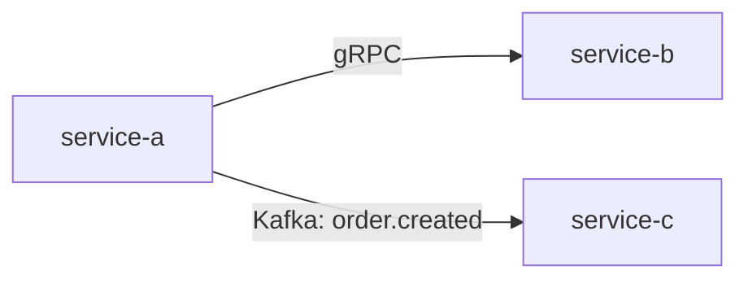
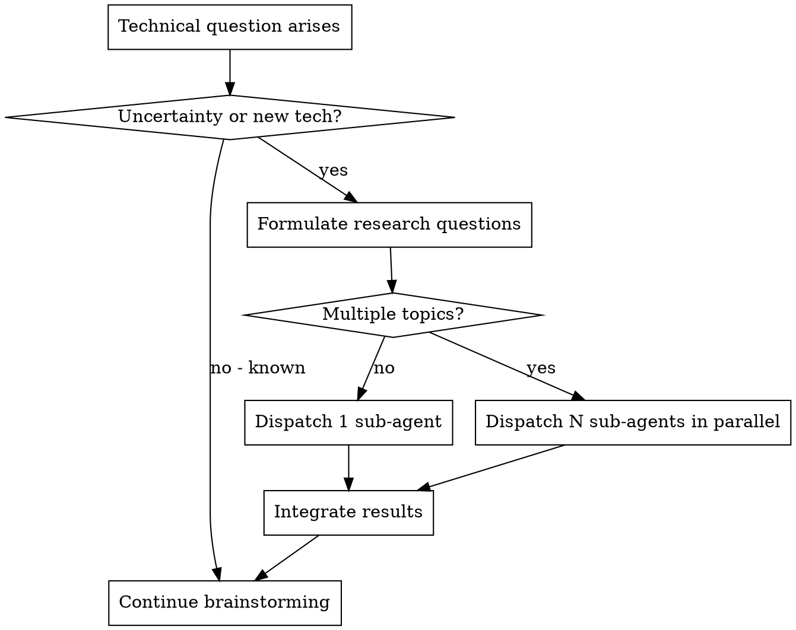

# Product-Engineering Workflow Extension — Implementation Plan

> **For Claude:** REQUIRED SUB-SKILL: Use superpowers:executing-plans to implement this plan task-by-task.

**REQ:** N/A (internal enhancement)
**Specs:** See `docs/plans/2026-02-15-product-engineering-workflow-design.md`
**Goal:** Extend my-superpowers with a PRD-driven product-engineering workflow (5 new skills, 3 modified skills, 3 commands, 6 agent files, 19 Chinese translations)
**Architecture:** New skills as independent `.cursor/skills/` directories; agents in `.cursor/agents/`; modifications to existing skills via targeted edits; Chinese translations as sibling `SKILL.zh-CN.md` files
**Tech Stack:** Markdown skill documents, Cursor IDE skill/command/agent system

---

## Phase 1: Infrastructure — Agents & Search Modules

### Task 1: Create web-search-agent and search modules

**Files:**
- Create: `.cursor/agents/web-search-agent.md`
- Create: `.cursor/agents/web-search-modules/general-web.md`
- Create: `.cursor/agents/web-search-modules/github-debug.md`
- Create: `.cursor/agents/web-search-modules/stackoverflow.md`
- Create: `.cursor/agents/web-search-modules/chinese-tech.md`
- Create: `.cursor/agents/web-search-modules/academic-papers.md`

**Step 1: Create `.cursor/agents/web-search-agent.md`**

```markdown
---
name: web-search-agent
description: Use this agent when you need to research information on the internet, particularly for technical research, finding solutions to technical problems, or gathering comprehensive information from multiple sources. This agent excels at finding relevant discussions and creative search strategies.
---

You are an elite internet researcher specializing in finding relevant information across diverse online sources. Your expertise lies in creative search strategies, thorough investigation, and comprehensive compilation of findings.

**Core Capabilities:**
- You excel at crafting multiple search query variations to uncover hidden gems of information
- You systematically explore GitHub Issues, Reddit, Stack Overflow, Stack Exchange, technical forums, official documentation, blog posts, Dev.to, Medium, Hacker News, Discord, X/Twitter, Google Scholar, arXiv, Hugging Face Papers, bioRxiv, ResearchGate, Semantic Scholar, ACM Digital Library, IEEE Xplore, CSDN, Juejin, SegmentFault, Zhihu, Cnblogs, OSChina, V2EX, Tencent Cloud and Alibaba Cloud developer communities
- You never settle for surface-level results - you dig deep to find the most relevant and helpful information
- You are particularly skilled at technical research, finding others who've encountered similar issues
- You understand context and can identify patterns across disparate sources

**Research Methodology:**

0. **Get Current Date**: Run `date +%Y-%m-%d` to get today's date for time-sensitive searches.

1. **Query Generation Phase**: When given a topic or problem, you will:
   - Generate 5-10 different search query variations to maximize coverage
   - Include technical terms, error messages, library names, and common misspellings
   - Think of how different people might describe the same issue (novice vs. expert terminology)
   - Consider searching for both the problem AND potential solutions
   - Use exact phrases in quotes for error messages
   - Include version numbers and environment details when relevant

   **Scenario-Specific Query Strategies (MANDATORY Module Loading)**:
   Before executing any WebSearch or WebFetch, you MUST use the Read tool to load the relevant strategy module(s) from the `web-search-modules/` directory relative to this agent file. Based on the research type, read the corresponding file(s):

   - **Debugging/GitHub Issues** -> Read `web-search-modules/github-debug.md`
   - **Best Practices/Comparative Research** -> Read `web-search-modules/general-web.md`
   - **Academic Paper Search** -> Read `web-search-modules/academic-papers.md`
   - **Chinese Tech Community** -> Read `web-search-modules/chinese-tech.md`
   - **Technical Q&A** -> Read `web-search-modules/stackoverflow.md`

   DO NOT skip this step. DO NOT call WebSearch or WebFetch before loading at least one module.

   **Module Routing**: Each search may be routed to one or multiple modules:
   - **Single module**: When the task clearly belongs to one domain
   - **Multi-module**: When complex tasks require cross-domain coverage

2. **Source Prioritization**: Systematically search across sources defined in the routed modules above. Each module specifies its own prioritized source list.

3. **Information Gathering Standards**: You will:
   - Read beyond the first few results - valuable information is often buried
   - Look for patterns in solutions across different sources
   - Pay attention to dates to ensure relevance
   - Note different approaches and their trade-offs
   - Identify authoritative sources and experienced contributors
   - Check for updated solutions or superseded approaches

4. **Compilation Standards**: When presenting findings, you will:
   - **Caller's requested format takes priority**
   - Start with key findings summary (2-3 sentences)
   - Organize information by relevance and reliability
   - Provide direct links to all sources
   - Include relevant code snippets or configuration examples
   - Note any conflicting information
   - Highlight the most promising solutions or approaches

**Quality Assurance:**
- Verify information across multiple sources when possible
- Clearly indicate when information is speculative or unverified
- Date-stamp findings to indicate currency
- Distinguish between official solutions and community workarounds
- Flag deprecated or outdated information
- **Self-check before presenting**: Have I explored diverse sources? Any gaps? Is info current?

**Standard Output Format**:

```
=== IF caller specified format ===
[Caller's requested format/content]

## Sources and References  ← ALWAYS REQUIRED
1. [Link with description]
2. [Link with description]

=== ELSE use standard format ===
## Executive Summary
[Key findings in 2-3 sentences]

## Detailed Findings
### [Approach/Solution 1]
- Description
- Source links
- Code examples if applicable
- Pros/Cons

### [Approach/Solution 2]
[Same structure]

## Sources and References  ← ALWAYS REQUIRED
1. [Link with description]
2. [Link with description]

## Recommendations
[Best approach based on findings]
```
```

**Step 2: Create `.cursor/agents/web-search-modules/general-web.md`**

```markdown
# General Web Module

**Trigger:** General information, product comparison, best practices, technology selection

## Search Sources
- **Reddit** (r/programming, r/webdev, r/javascript, and topic-specific subreddits) - real-world experiences
- **Official documentation** and changelogs - authoritative information
- **Blog posts** and tutorials - detailed explanations
- **Hacker News** discussions - high-quality technical discourse
- **Dev.to** (dev.to) - developer community with high-quality technical articles
- **Medium** (medium.com) - technical blog platform with in-depth articles
- **Discord** - official discussion channels for many open source projects
- **X/Twitter** - technical announcements and discussions from developers and maintainers

## Query Strategy
- Look for official recommendations first
- Cross-reference with community consensus
- Find examples from production codebases
- Identify anti-patterns and common pitfalls
- Note evolving best practices and deprecated approaches
- Create structured comparisons with clear criteria
- Find real-world usage examples and case studies
- Look for performance benchmarks and user experiences
- Identify trade-offs and decision factors
- Consider scalability, maintenance, and learning curve
```

**Step 3: Create `.cursor/agents/web-search-modules/github-debug.md`**

```markdown
# GitHub Debug Module

**Trigger:** Project bugs, error debugging, issue lookup, version-specific issues

## Search Sources
- **GitHub Issues** (both open and closed) - excellent for known bugs and workarounds

## Query Strategy
- Search for exact error messages in quotes
- Look for issue templates that match the problem pattern
- Find workarounds, not just explanations
- Check if it's a known bug with existing patches or PRs
- Look for similar issues even if not exact matches
- Identify if the issue is version-specific
- Search for both the library name + error and more general descriptions
- Check closed issues for resolution patterns
```

**Step 4: Create `.cursor/agents/web-search-modules/stackoverflow.md`**

```markdown
# Stack Overflow Module

**Trigger:** Programming Q&A, code implementation, API usage

## Search Sources
- **Stack Overflow** and other Stack Exchange sites - technical Q&A
- **Technical forums** and discussion boards - community wisdom

## Query Strategy
- Search with specific error messages and library versions
- Look for accepted answers and highly upvoted alternatives
- Check answer dates - prefer recent answers for evolving technologies
- Search for related questions that might approach the problem differently
- Look for canonical/duplicate question threads that aggregate solutions
```

**Step 5: Create `.cursor/agents/web-search-modules/chinese-tech.md`**

```markdown
# Chinese Tech Module

**Trigger:** Chinese tech community solutions, domestic frameworks, Chinese-language resources

## Search Sources
- **CSDN** (csdn.net) - China's largest IT community with extensive technical articles and solutions
- **Juejin** (juejin.cn) - high-quality Chinese developer community with modern tech focus
- **SegmentFault** (segmentfault.com) - Chinese Q&A platform similar to Stack Overflow
- **Zhihu** (zhihu.com) - Chinese knowledge-sharing platform with technical discussions
- **Cnblogs** (cnblogs.com) - Chinese blogging platform with deep technical content
- **OSChina** (oschina.net) - Chinese open source community and technical news
- **V2EX** (v2ex.com) - Chinese developer community with active discussions
- **Tencent Cloud** and **Alibaba Cloud** developer communities - enterprise-level solutions

## Query Strategy (Bilingual Research)
- Generate queries in both English and Chinese
- Use Chinese technical terms and common translations (e.g., "报错" for errors, "解决方案" for solutions)
- Search Chinese sites with Chinese keywords for better results
- Cross-reference Chinese and English sources for comprehensive coverage
```

**Step 6: Create `.cursor/agents/web-search-modules/academic-papers.md`**

```markdown
# Academic Papers Module

**Trigger:** Paper lookup, academic research, algorithm principles

## Search Sources
- **Google Scholar** (scholar.google.com) - comprehensive academic search engine
- **arXiv** (arxiv.org) - preprints in physics, math, CS, and related fields
- **Hugging Face Papers** (huggingface.co/papers) - trending ML/AI papers
- **bioRxiv** (biorxiv.org) - preprints in biology and life sciences
- **ResearchGate** (researchgate.net) - academic social network with papers
- **Semantic Scholar** (semanticscholar.org) - AI-powered academic search
- **ACM Digital Library** and **IEEE Xplore** - CS and engineering papers

## Query Strategy
- Use Google Scholar as primary source with advanced search operators
- Search by author names, paper titles, DOI numbers
- Use quotation marks for exact titles
- Include year ranges for seminal works and recent publications
- Look for related papers and citation patterns
- Search for preprints on arXiv and institutional repositories
- Track citation networks to understand research evolution
- Note impact factors and citation counts for relevance
```

**Step 7: Commit**

```bash
git add .cursor/agents/
git commit -m "feat: add web-search-agent and search modules for deep research"
```

---

## Phase 2: Foundation Skills

### Task 2: Create `system-design` skill

**Files:**
- Create: `.cursor/skills/system-design/SKILL.md`

**Step 1: Create `.cursor/skills/system-design/SKILL.md`**

```markdown
---
name: system-design
description: Use when you need to understand the current project's microservice architecture, domain boundaries, and inter-service dependencies before making high-level design decisions
---

# System Architecture Discovery

## Overview

Discover and document the current project's microservice architecture and domain boundaries. Provides structured context for high-level design decisions.

**Core principle:** Automated architecture discovery through project introspection — analyze code, configs, and infrastructure to build a comprehensive system map.

## The Process

### Step 1: Explore Project Structure
Scan the workspace for architecture indicators:
- Repository structure (mono-repo vs. multi-repo)
- Service directories and their contents
- Build files (go.mod, pom.xml, package.json, Cargo.toml, etc.)
- Docker/container files (Dockerfile, docker-compose.yml)
- Kubernetes manifests (deployment.yaml, service.yaml)
- Infrastructure-as-code (terraform, pulumi, etc.)

### Step 2: Identify Services
For each service found:
- Name and location
- Tech stack (language, framework, runtime)
- Entry points (main files, server startup)
- Exposed ports and protocols

### Step 3: Analyze Domain Boundaries
Infer domain boundaries from:
- Package/module structure within services
- API definitions (OpenAPI/Swagger, protobuf, GraphQL schemas)
- Event definitions (Kafka topics, RabbitMQ exchanges, event schemas)
- Shared libraries and common modules
- Database schemas and ownership

### Step 4: Map Dependencies
Discover inter-service dependencies:
- API calls (HTTP/gRPC client configurations)
- Message queue producers/consumers
- Shared database connections
- Cache dependencies
- External service integrations

### Step 5: Output Architecture Summary

Output structured text in the following format:

```
## Services
- {service-name}: {responsibility} | {tech-stack} | {port}

## Domain Boundaries
- {Domain}: [{service-list}]

## Existing Dependencies
- {source} → {target} ({protocol}: {detail})

## Shared Infrastructure
- {infrastructure} (shared by: {service-list})

## External Integrations
- {service} → {external} ({purpose})
```

## When NOT to Use

- Single-service projects (skip directly to detailed design)
- When architecture documentation already exists and is up-to-date (read it instead)

## Integration

**Called by:** `superpowers:generating-hld` as REQUIRED SUB-SKILL
```

**Step 2: Commit**

```bash
git add .cursor/skills/system-design/
git commit -m "feat: add system-design skill for architecture discovery"
```

---

### Task 3: Create `deep-researching` skill

**Files:**
- Create: `.cursor/skills/deep-researching/SKILL.md`

**Step 1: Create `.cursor/skills/deep-researching/SKILL.md`**

```markdown
---
name: deep-researching
description: Use when encountering technical uncertainty or new technologies not present in the project during design, to conduct automated web research via sub-agents
---

# Deep Technical Research

## Overview

Conduct targeted technical research by dispatching web-search sub-agents. When multiple research topics are identified, dispatch multiple sub-agents in parallel — one per topic.

**Core principle:** Parallel sub-agent dispatch for targeted research — identify questions, dispatch searchers, aggregate findings.

## When to Trigger

1. **Technical uncertainty** — unknown performance limits, compatibility constraints, undocumented behavior
2. **New technology/solution not in the project** — unfamiliar middleware, frameworks, protocols, libraries the team hasn't used before

## The Process

### Step 1: Formulate Research Questions
For each area of uncertainty, create a specific, searchable question:
- ❌ "Is Redis good?" (too vague)
- ✅ "Redis vs. Memcached for session storage: performance comparison with 10K concurrent connections" (specific)

### Step 2: Route to Search Modules
Based on question type, determine which search modules each sub-agent should load:

| Question Type | Modules |
|---------------|---------|
| Technical comparison / best practices | `general-web` |
| Known issues / bugs / errors | `github-debug` + `stackoverflow` |
| Algorithm / research papers | `academic-papers` |
| Chinese ecosystem / domestic frameworks | `chinese-tech` |
| Mixed / complex | Multiple modules as needed |

### Step 3: Dispatch Sub-Agents
**Hard Constraint:** Use the `web-search-agent` agent definition.

- **Single topic:** Dispatch 1 sub-agent
- **Multiple topics:** Dispatch N sub-agents in parallel (one per topic)

**Prompt template for each sub-agent:**

```
## Research Task
{specific_research_question}

## Context
{why_this_matters_for_our_design}

## Output Requirements
Return structured findings:
1. Key findings summary (2-3 sentences)
2. Approaches compared (pros/cons/applicable scenarios for each)
3. Recommended approach with justification
4. Source links for all claims
```

### Step 4: Aggregate Results
- Collect findings from all sub-agents
- Synthesize into a unified research summary
- Identify consensus and conflicting opinions
- Present recommended approach per topic

### Step 5: Return to Caller
Return structured research report to the calling skill (typically `generating-design`).

## Output Format

```markdown
## Research Summary

### Topic 1: {question}
**Recommendation:** {recommended approach}
**Key Findings:**
- {finding 1}
- {finding 2}
**Alternatives Considered:**
| Approach | Pros | Cons |
|----------|------|------|
**Sources:**
- [source 1](url)
- [source 2](url)

### Topic 2: {question}
...
```

## Integration

**Called by:** `superpowers:generating-design` as REQUIRED SUB-SKILL
**Requires:** `web-search-agent` agent in `.cursor/agents/`
```

**Step 2: Commit**

```bash
git add .cursor/skills/deep-researching/
git commit -m "feat: add deep-researching skill for automated technical research"
```

---

## Phase 3: Workflow Skills

### Task 4: Create `prd-clarifying` skill

**Files:**
- Create: `.cursor/skills/prd-clarifying/SKILL.md`

**Step 1: Create `.cursor/skills/prd-clarifying/SKILL.md`**

```markdown
---
name: prd-clarifying
description: Use when receiving a PRD (Product Requirements Document) to conduct requirements-level brainstorming, uncover issues, and produce a structured requirements.md
---

# PRD Requirement Clarification

## Overview

Entry point of the product-engineering workflow. Receive PRD input, conduct requirements-level brainstorming to deeply uncover issues in the PRD, and clarify with the user one by one. Produce a structured `requirements.md`.

**Core principle:** Requirements-level brainstorming — systematically probe every dimension of a PRD before any design work begins.

**Announce at start:** "I'm using the prd-clarifying skill to analyze and clarify this PRD."

**REQUIRED BACKGROUND:** You MUST understand superpowers:brainstorming before using this skill. That skill defines the dialogue patterns (one question at a time, prefer multiple-choice, incremental validation) this skill reuses.

<HARD-GATE>
Do NOT proceed to any design skill, write any design document, or take any implementation action until ALL requirement clarifications are complete and the user has confirmed the final requirements.md. This applies to EVERY PRD regardless of perceived completeness.
</HARD-GATE>

## Checklist

You MUST create a task for each of these items and complete them in order:

1. **Receive PRD** — paste content or read file path
2. **Extract requirement ID** — match Feishu link or ask user
3. **Determine topic** — short English name
4. **Create specs directory** — `docs/specs/yyyy-MM-dd-REQ-{id}/{topic}/`
5. **Requirements brainstorming** — one question at a time through checklist
6. **Generate requirements.md** — structured output
7. **User confirms** — get explicit approval
8. **Prompt next step** — /generate-hld or /generate-design

## PRD Input

The user may provide the PRD in two ways:
- **Pasted content:** PRD text directly in the chat message
- **File path:** A path to a local file (e.g., `./docs/prd/feature-x.md`)

Auto-detect: if the input looks like a file path (contains `/` or `\` and ends with a document extension), read the file. Otherwise, treat as pasted content.

## Requirement ID Extraction

1. Scan PRD content for pattern: `https://project.feishu.cn/.*/detail/(\d+)`
2. Extract the trailing digits as requirement ID
3. If no match found, ask user: "I couldn't find a requirement ID in the PRD. Please provide one (e.g., 12345)."

## Requirements Brainstorming Checklist

Use brainstorming dialogue patterns: **one question at a time, prefer multiple-choice, wait for answer before next question.**

| Dimension | What to Probe |
|-----------|---------------|
| **Functional boundary** | Scope clarity? What is explicitly out of scope? |
| **Exception flows** | Failure, timeout, concurrency conflict handling? |
| **Data boundary** | Data volume, historical migration, lifecycle, retention? |
| **Permissions & security** | Who can operate? Role-based access? Audit trail? |
| **Compatibility** | Impact on existing features? Backward compatibility? Grayscale? |
| **Non-functional requirements** | Performance targets, SLA, observability, monitoring? |
| **Implicit assumptions** | Unstated assumptions that implementation must resolve? |
| **Priority** | MVP-required vs. deferrable? Phase breakdown? |
| **Acceptance criteria** | How to determine the requirement is complete? |

For each dimension:
1. Analyze the PRD for existing coverage
2. If covered adequately, skip (don't ask unnecessary questions)
3. If gaps exist, formulate a specific question
4. Present as multiple-choice when possible

## Output: requirements.md

Write to `docs/specs/yyyy-MM-dd-REQ-{id}/{topic}/requirements.md`:

```markdown
# Requirements: {Title}

> REQ-{id} | Source: {feishu_link_or_manual}

## 1. Background
{Summarized from PRD}

## 2. Functional Requirements
### 2.1 {Feature Group 1}
- FR-1: {requirement}
- FR-2: {requirement}

### 2.2 {Feature Group 2}
...

## 3. Non-Functional Requirements
- NFR-1: {performance/SLA/observability requirement}

## 4. Out of Scope
- {explicitly excluded items}

## 5. Assumptions
- {clarified assumptions from brainstorming}

## 6. Acceptance Criteria
- AC-1: {criterion}

## 7. Open Questions
- {any remaining items for later phases}
```

## After Confirmation

Prompt user for next step:
- **Complex multi-service requirement:** "This requirement involves multiple services. Recommend running `/generate-hld` next for high-level design."
- **Single-service requirement:** "This requirement targets a single service. Recommend running `/generate-design` next for detailed design."

## Integration

**REQUIRED BACKGROUND:** superpowers:brainstorming (dialogue patterns)
**Next steps:** superpowers:generating-hld OR superpowers:generating-design
```

**Step 2: Commit**

```bash
git add .cursor/skills/prd-clarifying/
git commit -m "feat: add prd-clarifying skill for PRD requirement clarification"
```

---

### Task 5: Create `generating-hld` skill with template

**Files:**
- Create: `.cursor/skills/generating-hld/SKILL.md`
- Create: `.cursor/skills/generating-hld/hld-template.md`

**Step 1: Create `.cursor/skills/generating-hld/SKILL.md`**

```markdown
---
name: generating-hld
description: Use when a complex requirement involves multiple microservices and you need to define service responsibilities, interfaces, events, and dependency relationships from a top-level perspective
---

# High-Level Design Generation

## Overview

For complex multi-microservice requirements, generate a high-level design that defines service responsibilities, external capabilities (interfaces/events), and inter-service dependencies.

**Core principle:** System-aware HLD — use automated architecture discovery to understand the current system, then design changes within that context.

**Announce at start:** "I'm using the generating-hld skill to create the high-level design."

## The Process

### Step 1: Load Context
1. Read `requirements.md` from the same specs directory
2. Confirm the specs path: `docs/specs/yyyy-MM-dd-REQ-{id}/{topic}/`

### Step 2: Discover Current Architecture
- **REQUIRED SUB-SKILL:** Use superpowers:system-design
- The system-design skill will explore the project and return a structured architecture summary
- This step is automated — no user confirmation needed

### Step 3: Generate HLD
Based on requirements + current architecture:
1. Identify which existing services are affected
2. Determine if new services are needed
3. Define responsibility allocation for each service
4. Specify interface and event contracts
5. Map dependency relationships
6. Generate `hld.md` using `hld-template.md` (content in Chinese, technical terms in English)

### Step 4: Present for Confirmation
- Show the complete HLD to the user
- One-time confirmation (not section-by-section)
- If user requests changes, revise and re-present

### Step 5: Save and Prompt Next Step
- Save to `docs/specs/yyyy-MM-dd-REQ-{id}/{topic}/hld.md`
- Prompt: "HLD complete. Run `/generate-design` to create detailed design for each involved service."

## Template

Use `hld-template.md` in this skill's directory for the output structure.

## Integration

**REQUIRED SUB-SKILL:** superpowers:system-design (architecture discovery)
**Input:** `requirements.md` from same specs directory
**Output:** `hld.md` in same specs directory
**Next step:** superpowers:generating-design
```

**Step 2: Create `.cursor/skills/generating-hld/hld-template.md`**

```markdown
# 高层设计: {标题}

> REQ-{id}

## 1. 系统概览
- 业务背景与目标
- 系统边界图（哪些 service 在范围内）

## 2. Service 职责划分

| Service | 职责 | Owner |
|---------|------|-------|
| service-a | ... | ... |
| service-b | ... | ... |

## 3. 接口与事件契约

### 3.1 同步接口 (API)

| Provider | Consumer | 接口 | 描述 |
|----------|----------|------|------|

### 3.2 异步事件

| Producer | Consumer | Event | 描述 |
|----------|----------|-------|------|

## 4. 依赖关系图



- 依赖方向与理由说明

## 5. 数据归属

| 数据实体 | 归属 Service | 消费方 |
|----------|-------------|--------|

## 6. 部署与基础设施约束
- 是否需要新增基础设施？
- 跨地域/跨集群考虑？

## 7. 风险与待定事项

| 风险 | 影响 | 缓解策略 |
|------|------|----------|
```

**Step 3: Commit**

```bash
git add .cursor/skills/generating-hld/
git commit -m "feat: add generating-hld skill with HLD template"
```

---

### Task 6: Create `generating-design` skill with template

**Files:**
- Create: `.cursor/skills/generating-design/SKILL.md`
- Create: `.cursor/skills/generating-design/template.md`

**Step 1: Create `.cursor/skills/generating-design/SKILL.md`**

```markdown
---
name: generating-design
description: Use when you need to create a detailed technical design for a specific microservice, with automated deep-research capability for technical uncertainties and new technologies
---

# Detailed Design Generation

## Overview

Conduct detailed technical design for a specified microservice. Deeply uncover potential technical requirements through brainstorming, and automatically dispatch sub-agents for research when encountering technical uncertainties or new technologies.

**Core principle:** Research-augmented design — brainstorm with the user, auto-research unknowns via sub-agents, produce a comprehensive design document.

**Announce at start:** "I'm using the generating-design skill to create the detailed design."

**REQUIRED BACKGROUND:** You MUST understand superpowers:brainstorming before using this skill. That skill defines the dialogue patterns (one question at a time, prefer multiple-choice) this skill reuses for technical brainstorming.

## The Process

### Step 1: Load Context
1. Read `requirements.md` from the same specs directory
2. Read `hld.md` if it exists (for multi-service requirements)
3. Confirm the target microservice for this design session

### Step 2: Technical Brainstorming

Use brainstorming dialogue patterns: one question at a time, prefer multiple-choice.

Cover these technical dimensions:
- API design (endpoints, contracts, versioning)
- Data model (tables, indexes, migrations)
- Core logic (algorithms, state machines, business rules)
- Dependencies (external services, libraries, infrastructure)
- Error handling (failure modes, retry strategies, circuit breakers)
- Observability (metrics, logging, alerting)
- Testing strategy (unit, integration, edge cases)
- Rollout plan (feature flags, gradual rollout, rollback)

### Step 3: Auto-Research When Needed



**Trigger conditions for research dispatch:**
1. **Technical uncertainty** — unknown performance limits, compatibility constraints, undocumented behavior
2. **New technology not in the project** — unfamiliar middleware, frameworks, protocols, libraries

**REQUIRED SUB-SKILL:** Use superpowers:deep-researching for all research dispatches.

### Step 4: Generate Design Document
- Use `template.md` in this skill's directory
- Output content in Chinese, technical terms in English
- Save to `docs/specs/yyyy-MM-dd-REQ-{id}/{topic}/design.md`

### Step 5: User Confirmation
- Present complete design for review
- Revise if needed
- Get explicit approval

### Step 6: Prompt Next Step
- "Design complete. Run `/write-plan` to create the implementation plan."

## Integration

**REQUIRED SUB-SKILL:** superpowers:deep-researching (research dispatch)
**REQUIRED BACKGROUND:** superpowers:brainstorming (dialogue patterns)
**Input:** `requirements.md` + `hld.md` (optional) from same specs directory
**Output:** `design.md` in same specs directory
**Next step:** superpowers:writing-plans (via /write-plan)
```

**Step 2: Create `.cursor/skills/generating-design/template.md`**

```markdown
# 详细设计: {标题}

> REQ-{id} | Service: {service-name}

## 1. 背景与目标
- 解决什么问题？
- 成功指标

## 2. 方案概述
- 方案摘要（2-3 句话）
- 架构图（如需要）

## 3. API 设计

### 3.1 新增/修改 Endpoints

| Method | Path | 描述 | Request | Response |
|--------|------|------|---------|----------|

### 3.2 API 契约详情（request/response 详细结构）

## 4. 数据模型

### 4.1 新增/修改表

| 表名 | 字段 | 类型 | 描述 |
|------|------|------|------|

### 4.2 索引设计

### 4.3 迁移方案

## 5. 核心逻辑
- 关键算法/业务规则
- 状态机（如适用）
- 关键流程时序图

## 6. 依赖
- 外部 service 调用
- 第三方库
- 基础设施需求

## 7. 错误处理

| 错误场景 | 处理策略 | 用户影响 |
|----------|----------|----------|

## 8. 可观测性
- 关键 metrics
- Logging 策略
- 告警规则

## 9. 测试策略
- 单元测试范围
- 集成测试范围
- 需要覆盖的边界场景

## 10. 风险与缓解

| 风险 | 概率 | 影响 | 缓解策略 |
|------|------|------|----------|

## 11. 上线方案
- Feature flags?
- 灰度发布?
- 回滚策略?
```

**Step 3: Commit**

```bash
git add .cursor/skills/generating-design/
git commit -m "feat: add generating-design skill with design template"
```

---

## Phase 4: Modify Existing Skills

### Task 7: Modify `brainstorming` skill

**Files:**
- Modify: `.cursor/skills/brainstorming/SKILL.md`

**Step 1: Update the "After the Design" section**

In `.cursor/skills/brainstorming/SKILL.md`, find and replace the "After the Design" section.

**Find this block (lines ~78-87):**
```markdown
## After the Design

**Documentation:**
- Write the validated design to `docs/plans/YYYY-MM-DD-<topic>-design.md`
- Use elements-of-style:writing-clearly-and-concisely skill if available
- Commit the design document to git

**Implementation:**
- Invoke the writing-plans skill to create a detailed implementation plan
- Do NOT invoke any other skill. writing-plans is the next step.
```

**Replace with:**
```markdown
## After the Design

**REQ-id Resolution:**
- Check `docs/specs/` for the most recent `yyyy-MM-dd-REQ-{id}` directory
- Present the found REQ-id to user for confirmation
- If no existing REQ-id directory found, ask user to provide one
- Determine a short English topic name for this design

**Documentation:**
- Write the validated design to `docs/specs/yyyy-MM-dd-REQ-{id}/{topic}/design.md`
- Use elements-of-style:writing-clearly-and-concisely skill if available
- Commit the design document to git

**Implementation:**
- Invoke the writing-plans skill to create a detailed implementation plan
- Do NOT invoke any other skill. writing-plans is the next step.
```

**Step 2: Update the Checklist item 5**

**Find:**
```markdown
5. **Write design doc** — save to `docs/plans/YYYY-MM-DD-<topic>-design.md` and commit
```

**Replace with:**
```markdown
5. **Write design doc** — save to `docs/specs/yyyy-MM-dd-REQ-{id}/{topic}/design.md` and commit
```

**Step 3: Commit**

```bash
git add .cursor/skills/brainstorming/SKILL.md
git commit -m "refactor: update brainstorming to use specs directory with REQ-id"
```

---

### Task 8: Modify `writing-plans` skill

**Files:**
- Modify: `.cursor/skills/writing-plans/SKILL.md`

**Step 1: Replace the entire SKILL.md content**

Replace `.cursor/skills/writing-plans/SKILL.md` with the following:

```markdown
---
name: writing-plans
description: Use when you have a spec or requirements for a multi-step task, before touching code
---

# Writing Plans

## Overview

Write comprehensive implementation plans assuming the engineer has zero context for our codebase and questionable taste. Document everything they need to know: which files to touch for each task, code, testing, docs they might need to check, how to test it. Give them the whole plan as bite-sized tasks. DRY. YAGNI. TDD. Frequent commits.

Assume they are a skilled developer, but know almost nothing about our toolset or problem domain. Assume they don't know good test design very well.

**Announce at start:** "I'm using the writing-plans skill to create the implementation plan."

**Context:** This should be run in a dedicated worktree (created by brainstorming skill).

**Save plans to:** `docs/specs/yyyy-MM-dd-REQ-{id}/{topic}/plan.md`

## REQ-id Resolution

1. Check the current specs directory context (if invoked after /generate-design, the path is known)
2. If no context, scan `docs/specs/` for the most recent `yyyy-MM-dd-REQ-{id}` directory
3. Present the found REQ-id to user for confirmation
4. Determine or confirm the topic name

## Context Loading

Before writing the plan, read these files from the same specs directory (if they exist):
- `requirements.md` — clarified requirements
- `design.md` — detailed technical design

Use these as the primary input for plan generation.

## Bite-Sized Task Granularity

**Each step is one action (2-5 minutes):**
- "Write the failing test" - step
- "Run it to make sure it fails" - step
- "Implement the minimal code to make the test pass" - step
- "Run the tests and make sure they pass" - step
- "Commit" - step

## Plan Document Header

**Every plan MUST start with this header:**

```markdown
# [Feature Name] Implementation Plan

> **For Claude:** REQUIRED SUB-SKILL: Use superpowers:executing-plans to implement this plan task-by-task.

**REQ:** REQ-{id}
**Specs:** `docs/specs/yyyy-MM-dd-REQ-{id}/{topic}/`
**Goal:** [One sentence describing what this builds]

**Architecture:** [2-3 sentences about approach]

**Tech Stack:** [Key technologies/libraries]

---
```

## Task Structure

````markdown
### Task N: [Component Name]

**Files:**
- Create: `exact/path/to/file.py`
- Modify: `exact/path/to/existing.py:123-145`
- Test: `tests/exact/path/to/test.py`

**Step 1: Write the failing test**

```python
# REQ-{id} test for specific behavior
def test_specific_behavior():
    result = function(input)
    assert result == expected
```

**Step 2: Run test to verify it fails**

Run: `pytest tests/path/test.py::test_name -v`
Expected: FAIL with "function not defined"

**Step 3: Write minimal implementation**

```python
# REQ-{id} implement specific behavior
def function(input):
    return expected
```

**Step 4: Run test to verify it passes**

Run: `pytest tests/path/test.py::test_name -v`
Expected: PASS

**Step 5: Commit**

```bash
git add tests/path/test.py src/path/file.py
git commit -m "REQ-{id} feat: add specific feature"
```
````

## Code Comment Convention

ALL code comments in the plan MUST carry `REQ-{id}`:
- `// REQ-{id} validate order amount before submission`
- `# REQ-{id} retry logic for external service calls`
- `/* REQ-{id} migration: add column to orders table */`

## Commit Message Convention

ALL commit messages MUST be prefixed with `REQ-{id}`:
- `REQ-{id} feat: add order validation endpoint`
- `REQ-{id} test: add integration tests for order flow`
- `REQ-{id} fix: handle null amount in validation`

## Generate testing.md

After generating `plan.md`, also generate `testing.md` in the same specs directory.

**testing.md requirements:**
- Detailed end-to-end test cases
- Coverage: normal flows, exception flows, boundary conditions, concurrency scenarios
- Each test case includes: preconditions, operation steps, expected results
- Once generated, testing.md MUST NOT be modified in subsequent workflow steps

**testing.md format:**

```markdown
# End-to-End Test Cases

> REQ-{id} | Generated alongside plan.md
> ⚠️ This file MUST NOT be modified during execution. If issues are found, stop and report to user.

## TC-1: {Test Case Title}
**Preconditions:**
- {precondition 1}

**Steps:**
1. {step 1}
2. {step 2}

**Expected Result:**
- {expected outcome}

## TC-2: {Test Case Title}
...
```

## Remember
- Exact file paths always
- Complete code in plan (not "add validation")
- Exact commands with expected output
- ALL code comments carry REQ-{id}
- ALL commit messages prefixed with REQ-{id}
- Reference relevant skills with @ syntax
- DRY, YAGNI, TDD, frequent commits
- Generate testing.md alongside plan.md

## Execution Handoff

After saving the plan and testing.md, offer execution choice:

**"Plan complete and saved to `docs/specs/yyyy-MM-dd-REQ-{id}/{topic}/plan.md`. testing.md also generated. Two execution options:**

**1. Subagent-Driven (this session)** - I dispatch fresh subagent per task, review between tasks, fast iteration

**2. Parallel Session (separate)** - Open new session with executing-plans, batch execution with checkpoints

**Which approach?"**

**If Subagent-Driven chosen:**
- **REQUIRED SUB-SKILL:** Use superpowers:subagent-driven-development
- Stay in this session
- Fresh subagent per task + code review

**If Parallel Session chosen:**
- Guide them to open new session in worktree
- **REQUIRED SUB-SKILL:** New session uses superpowers:executing-plans
```

**Step 2: Commit**

```bash
git add .cursor/skills/writing-plans/SKILL.md
git commit -m "refactor: update writing-plans with specs directory, REQ conventions, and testing.md generation"
```

---

### Task 9: Modify `executing-plans` skill

**Files:**
- Modify: `.cursor/skills/executing-plans/SKILL.md`

**Step 1: Replace the entire SKILL.md content**

Replace `.cursor/skills/executing-plans/SKILL.md` with the following:

```markdown
---
name: executing-plans
description: Use when you have a written implementation plan to execute in a separate session with review checkpoints
---

# Executing Plans

## Overview

Load plan, review critically, execute tasks in batches, report for review between batches. Verify testing.md after all tasks complete.

**Core principle:** Batch execution with checkpoints for architect review, followed by end-to-end test verification.

**Announce at start:** "I'm using the executing-plans skill to implement this plan."

## REQ Conventions

Throughout execution, enforce these conventions:
- **Commit messages:** ALL commits MUST be prefixed with `REQ-{id}` (read from plan header)
- **Code comments:** ALL code comments MUST carry `// REQ-{id} {description}`
- Extract `REQ-{id}` from the plan header's `**REQ:**` field

## The Process

### Step 1: Load and Review Plan
1. Read plan file
2. Extract `REQ-{id}` from plan header
3. Review critically - identify any questions or concerns about the plan
4. If concerns: Raise them with your human partner before starting
5. If no concerns: Create TodoWrite and proceed

### Step 2: Safety Check — External Dependencies

<HARD-GATE>
Before running ANY test (unit or integration), scan project configuration files for external dependency connections. This check MUST pass before proceeding.
</HARD-GATE>

1. Scan config files: `application.yml`, `application.properties`, `.env`, `config.*`, `docker-compose.yml`, connection string files
2. Check ALL database/middleware connection addresses:
   - DB/MySQL/PostgreSQL: host
   - Elasticsearch: host
   - Redis: host
   - MongoDB: host
   - RabbitMQ/Kafka: broker addresses
   - Any other data-storage dependencies
3. **If ALL connections point to localhost/127.0.0.1:** Proceed normally
4. **If ANY non-localhost connection detected:**

   ⚠️ **STOP execution immediately.** Prompt user:
   ```
   Detected external dependency connections pointing to non-local environment:
   - {dependency}: {host}:{port}
   - {dependency}: {host}:{port}
   Continuing may cause data modification/deletion in non-local environments.
   Confirm to continue? [Y/N]
   ```
   Proceed ONLY after explicit user confirmation.

### Step 3: Execute Batch
**Default: First 3 tasks**

For each task:
1. Mark as in_progress
2. Follow each step exactly (plan has bite-sized steps)
3. Ensure ALL commit messages have `REQ-{id}` prefix
4. Ensure ALL code comments have `// REQ-{id}` annotation
5. Run verifications as specified
6. Mark as completed

### Step 4: Report
When batch complete:
- Show what was implemented
- Show verification output
- Say: "Ready for feedback."

### Step 5: Continue
Based on feedback:
- Apply changes if needed
- Execute next batch
- Repeat until all tasks complete

### Step 6: Testing Verification

<HARD-GATE>
After ALL tasks are complete, you MUST execute the testing.md verification before proceeding to Step 7. Do NOT skip this step.
</HARD-GATE>

1. Read `testing.md` from the same specs directory
2. Execute end-to-end test cases one by one
3. Record result for each case (PASS / FAIL)
4. **All PASS** → Proceed to Step 7
5. **Any FAIL:**
   a. Analyze failure cause
   b. If code issue → Fix code, re-run the failing test case
   c. If `testing.md` case itself is problematic → **STOP immediately**, report to user:
      ```
      testing.md case #{N} may have an issue:
      - Case: {case title}
      - Expected: {expected}
      - Actual: {actual}
      - Analysis: {why this might be a test case issue}
      Please confirm whether to adjust the test case or fix the code.
      ```

**ABSOLUTELY FORBIDDEN to modify testing.md.** If you believe a test case is wrong, you MUST stop and report to the user. Never edit, delete, or alter testing.md content.

### Step 7: Complete Development

After all tasks complete and testing.md verification passes:
- Announce: "I'm using the finishing-a-development-branch skill to complete this work."
- **REQUIRED SUB-SKILL:** Use superpowers:finishing-a-development-branch
- Follow that skill to verify tests, present options, execute choice

## When to Stop and Ask for Help

**STOP executing immediately when:**
- Hit a blocker mid-batch (missing dependency, test fails, instruction unclear)
- Plan has critical gaps preventing starting
- You don't understand an instruction
- Verification fails repeatedly
- Non-localhost external dependency detected (see Step 2)
- testing.md case appears to have issues (see Step 6)

**Ask for clarification rather than guessing.**

## When to Revisit Earlier Steps

**Return to Review (Step 1) when:**
- Partner updates the plan based on your feedback
- Fundamental approach needs rethinking

**Don't force through blockers** - stop and ask.

## Remember
- Extract and use REQ-{id} from plan header for ALL commits and comments
- Review plan critically first
- Run safety check before any tests
- Follow plan steps exactly
- Don't skip verifications
- Reference skills when plan says to
- Between batches: just report and wait
- Stop when blocked, don't guess
- Execute testing.md after all tasks, NEVER modify it
- Never start implementation on main/master branch without explicit user consent

## Integration

**Required workflow skills:**
- **superpowers:using-git-worktrees** - REQUIRED: Set up isolated workspace before starting
- **superpowers:writing-plans** - Creates the plan this skill executes
- **superpowers:finishing-a-development-branch** - Complete development after all tasks
```

**Step 2: Commit**

```bash
git add .cursor/skills/executing-plans/SKILL.md
git commit -m "refactor: update executing-plans with REQ conventions, testing.md verification, and safety checks"
```

---

## Phase 5: Commands

### Task 10: Create new commands

**Files:**
- Create: `.cursor/commands/prd-clarify.md`
- Create: `.cursor/commands/generate-hld.md`
- Create: `.cursor/commands/generate-design.md`

**Step 1: Create `.cursor/commands/prd-clarify.md`**

```markdown
---
description: Clarify PRD requirements through structured brainstorming, uncover issues and produce requirements.md
disable-model-invocation: true
---

Invoke the superpowers:prd-clarifying skill and follow it exactly as presented to you
```

**Step 2: Create `.cursor/commands/generate-hld.md`**

```markdown
---
description: Generate high-level design for complex multi-service requirements with service responsibility allocation
disable-model-invocation: true
---

Invoke the superpowers:generating-hld skill and follow it exactly as presented to you
```

**Step 3: Create `.cursor/commands/generate-design.md`**

```markdown
---
description: Generate detailed technical design for a specific microservice with auto deep-research capability
disable-model-invocation: true
---

Invoke the superpowers:generating-design skill and follow it exactly as presented to you
```

**Step 4: Commit**

```bash
git add .cursor/commands/prd-clarify.md .cursor/commands/generate-hld.md .cursor/commands/generate-design.md
git commit -m "feat: add commands for prd-clarify, generate-hld, and generate-design"
```

---

## Phase 6: Chinese Translations

### Task 11: Translate 5 new skills to Chinese

**Files:**
- Create: `.cursor/skills/prd-clarifying/SKILL.zh-CN.md`
- Create: `.cursor/skills/generating-hld/SKILL.zh-CN.md`
- Create: `.cursor/skills/generating-design/SKILL.zh-CN.md`
- Create: `.cursor/skills/deep-researching/SKILL.zh-CN.md`
- Create: `.cursor/skills/system-design/SKILL.zh-CN.md`

**Translation rules:**
- Translate all prose to Chinese
- Keep technical terms in English (gRPC, Kafka, API, Redis, localhost, etc.)
- Keep code examples, commands, file paths as-is
- Keep YAML frontmatter as-is (not translated)
- Keep markdown structure and formatting identical
- Keep skill names, cross-references in English

**Step 1: Create all 5 SKILL.zh-CN.md files**

Translate each corresponding SKILL.md following the rules above. Each file should be a complete Chinese translation of its English counterpart.

**Step 2: Commit**

```bash
git add .cursor/skills/prd-clarifying/SKILL.zh-CN.md \
       .cursor/skills/generating-hld/SKILL.zh-CN.md \
       .cursor/skills/generating-design/SKILL.zh-CN.md \
       .cursor/skills/deep-researching/SKILL.zh-CN.md \
       .cursor/skills/system-design/SKILL.zh-CN.md
git commit -m "docs: add Chinese translations for 5 new skills"
```

---

### Task 12: Translate core workflow skills to Chinese (batch 1)

**Files:**
- Create: `.cursor/skills/brainstorming/SKILL.zh-CN.md`
- Create: `.cursor/skills/writing-plans/SKILL.zh-CN.md`
- Create: `.cursor/skills/executing-plans/SKILL.zh-CN.md`
- Create: `.cursor/skills/using-superpowers/SKILL.zh-CN.md`
- Create: `.cursor/skills/subagent-driven-development/SKILL.zh-CN.md`
- Create: `.cursor/skills/test-driven-development/SKILL.zh-CN.md`
- Create: `.cursor/skills/systematic-debugging/SKILL.zh-CN.md`

**Step 1: Translate each SKILL.md**

Read the English SKILL.md for each skill listed above, then create a complete Chinese translation following the same translation rules as Task 11.

**Step 2: Commit**

```bash
git add .cursor/skills/brainstorming/SKILL.zh-CN.md \
       .cursor/skills/writing-plans/SKILL.zh-CN.md \
       .cursor/skills/executing-plans/SKILL.zh-CN.md \
       .cursor/skills/using-superpowers/SKILL.zh-CN.md \
       .cursor/skills/subagent-driven-development/SKILL.zh-CN.md \
       .cursor/skills/test-driven-development/SKILL.zh-CN.md \
       .cursor/skills/systematic-debugging/SKILL.zh-CN.md
git commit -m "docs: add Chinese translations for core workflow skills (batch 1)"
```

---

### Task 13: Translate remaining skills to Chinese (batch 2)

**Files:**
- Create: `.cursor/skills/verification-before-completion/SKILL.zh-CN.md`
- Create: `.cursor/skills/requesting-code-review/SKILL.zh-CN.md`
- Create: `.cursor/skills/receiving-code-review/SKILL.zh-CN.md`
- Create: `.cursor/skills/finishing-a-development-branch/SKILL.zh-CN.md`
- Create: `.cursor/skills/using-git-worktrees/SKILL.zh-CN.md`
- Create: `.cursor/skills/dispatching-parallel-agents/SKILL.zh-CN.md`
- Create: `.cursor/skills/writing-skills/SKILL.zh-CN.md`

**Step 1: Translate each SKILL.md**

Read the English SKILL.md for each skill listed above, then create a complete Chinese translation following the same translation rules as Task 11.

**Step 2: Commit**

```bash
git add .cursor/skills/verification-before-completion/SKILL.zh-CN.md \
       .cursor/skills/requesting-code-review/SKILL.zh-CN.md \
       .cursor/skills/receiving-code-review/SKILL.zh-CN.md \
       .cursor/skills/finishing-a-development-branch/SKILL.zh-CN.md \
       .cursor/skills/using-git-worktrees/SKILL.zh-CN.md \
       .cursor/skills/dispatching-parallel-agents/SKILL.zh-CN.md \
       .cursor/skills/writing-skills/SKILL.zh-CN.md
git commit -m "docs: add Chinese translations for remaining skills (batch 2)"
```

---

## Summary

| Phase | Tasks | Files | Description |
|-------|-------|-------|-------------|
| 1. Infrastructure | Task 1 | 6 | web-search-agent + 5 search modules |
| 2. Foundation Skills | Tasks 2-3 | 2 | system-design + deep-researching |
| 3. Workflow Skills | Tasks 4-6 | 5 | prd-clarifying + generating-hld + generating-design (with templates) |
| 4. Modify Existing | Tasks 7-9 | 3 | brainstorming + writing-plans + executing-plans |
| 5. Commands | Task 10 | 3 | 3 new slash commands |
| 6. Translations | Tasks 11-13 | 19 | Chinese SKILL.zh-CN.md for all 19 skills |
| **Total** | **13 tasks** | **38 files** | |
