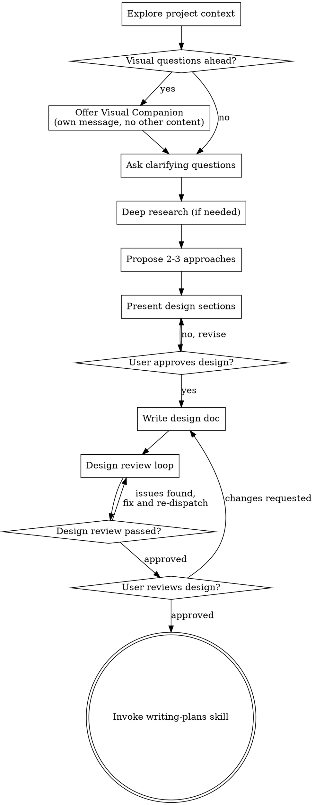

# 头脑风暴：将想法转化为设计

## 概述

通过自然的协作对话，帮助将想法转化为完整的设计方案。

首先了解当前项目的上下文，然后逐一提问以完善想法。一旦你理解了要构建什么，就展示设计方案并获得用户批准。

<HARD-GATE>
在你展示设计方案并获得用户批准之前，不要调用任何实现相关的 skill，不要编写任何代码，不要搭建任何项目框架，也不要采取任何实现行动。无论项目看起来多么简单，这一规则都适用于每一个项目。
</HARD-GATE>

## 反模式："这个太简单了，不需要设计"

每个项目都要经过这个流程。无论是一个待办列表、一个单函数工具还是一个配置修改——所有项目都是如此。"简单"的项目恰恰是未经审视的假设造成最多浪费的地方。设计可以很简短（对于真正简单的项目只需几句话），但你必须展示设计方案并获得批准。

## 检查清单

你必须为以下每个条目创建一个任务，并按顺序完成：

1. **探索项目上下文** — 检查文件、文档、最近的提交
2. **提供 visual companion**（如果主题将涉及视觉问题）— 这是一条独立的消息，不要与澄清问题合并。详见下方 Visual Companion 部分。
3. **提出澄清问题** — 一次一个，理解目的/约束/成功标准
4. **深度调研** — 针对需要最新行业实践的技术决策，派遣调研子代理
5. **提出 2-3 种方案** — 包含权衡分析和你的推荐，以调研证据为支撑
6. **展示设计方案** — 各部分按其复杂度进行展开，每个部分完成后获得用户批准
7. **编写设计文档** — 保存到 `docs/specs/yyyy-MM-dd-REQ-{id}/{topic}/design.md` 并提交
8. **Design review loop** — 派遣 spec-document-reviewer subagent，提供精确构建的审查上下文（绝不使用你的会话历史）；修复问题并重新派遣，直到通过审查（最多 5 次迭代，之后交由人工处理）
9. **用户审查已编写的设计文档** — 在继续之前请用户审查设计文档
10. **过渡到实现** — 调用 writing-plans skill 创建实现计划

## 流程图

**终态是调用 writing-plans。** 不要调用 frontend-design、mcp-builder 或任何其他实现 skill。头脑风暴之后你唯一应该调用的 skill 是 writing-plans。

## 流程详解

**理解想法：**

- 首先查看当前项目状态（文件、文档、最近的提交）
- 在提出详细问题之前，先评估项目规模：如果需求描述了多个独立子系统（例如"构建一个包含聊天、文件存储、计费和分析的平台"），应立即指出这一点。不要花费问题去细化一个需要先被拆解的项目。
- 如果项目对于单个设计来说过于庞大，帮助用户拆解为子项目：独立的部分有哪些，它们之间有什么关系，应该按什么顺序构建？然后按照正常的设计流程对第一个子项目进行头脑风暴。每个子项目都有自己的 design → plan → implementation 循环。
- 对于规模适当的项目，逐一提问以完善想法
- 尽可能使用选择题，开放式问题也可以
- 每条消息只提一个问题——如果某个主题需要更多探讨，就拆分成多个问题
- 重点理解：目的、约束、成功标准

**深度调研（在提出方案之前）：**

- 澄清问题结束后，识别需要调研的技术决策（中间件选型、架构模式、引入新技术、性能关键设计）
- 对每个此类决策，通过 superpowers:deep-researching 派遣调研子代理获取最新行业实践和社区方案
- 多个主题可并行调研
- 在提出方案之前整合调研结果

**探索方案：**

- 提出 2-3 种不同的方案及其权衡
- 以对话方式呈现选项，附上你的推荐和理由
- 先展示你推荐的方案并解释原因
- 以调研证据（社区实践、性能基准、权衡分析）为各选项的支撑

**展示设计：**

- 一旦你认为自己理解了要构建的内容，就展示设计方案
- 每个部分按其复杂度调整篇幅：简单的用几句话，复杂的最多 200-300 字
- 每个部分结束后询问目前看起来是否正确
- 涵盖：架构、组件、数据流、错误处理、测试
- 准备好在有不清楚的地方时回头澄清

**为隔离性和清晰度而设计：**

- 将系统拆分为更小的单元，每个单元有一个明确的职责，通过定义良好的接口进行通信，并且可以独立理解和测试
- 对于每个单元，你应该能够回答：它做什么，如何使用它，它依赖什么？
- 别人能否不读内部实现就理解一个单元的功能？你能否在不破坏消费者的情况下修改内部实现？如果不能，边界需要重新设计。
- 更小、边界清晰的单元也更便于你工作——你对能在上下文中完整容纳的代码推理得更好，当文件职责集中时你的编辑也更可靠。当一个文件变得过大时，通常意味着它承担了太多职责。

**在已有代码库中工作：**

- 在提出修改方案之前，先探索当前的代码结构。遵循已有的模式。
- 当已有代码中存在影响当前工作的问题时（例如文件过大、边界不清晰、职责纠缠），在设计中纳入有针对性的改进——就像一个优秀的开发者在工作中顺手改善接触到的代码一样。
- 不要提出无关的重构。保持专注于服务当前目标的内容。

## 设计之后

**REQ-id 确认：**

- 检查 `docs/specs/` 中最近的 `yyyy-MM-dd-REQ-{id}` 目录
- 向用户展示找到的 REQ-id 以确认
- 如果没有找到现有的 REQ-id 目录，请用户提供一个
- 为此设计确定一个简短的英文主题名称

**文档编写：**

- 将验证通过的设计写入 `docs/specs/yyyy-MM-dd-REQ-{id}/{topic}/design.md`
  - （用户对设计文档存放位置的偏好优先于此默认路径）
- 如果可用，使用 elements-of-style:writing-clearly-and-concisely skill
- 将设计文档提交到 git

**Design Review Loop：**
编写完设计文档后：

1. 派遣 spec-document-reviewer subagent（参见 spec-document-reviewer-prompt.md）
2. 如果发现问题：修复，重新派遣，重复直到通过审查
3. 如果循环超过 5 次迭代，交由人工指导

**User Review Gate：**
Design review loop 通过后，在继续之前请用户审查已编写的设计文档：

> "设计文档已编写并提交到 `<path>`。请审查并告知是否需要在我们开始编写实现计划之前做任何修改。"

等待用户回复。如果用户要求修改，完成修改后重新运行 design review loop。只有在用户批准后才能继续。

**实现：**

- 调用 writing-plans skill 创建详细的实现计划
- 不要调用任何其他 skill。writing-plans 是下一步。

## 关键原则

- **一次一个问题** - 不要一次抛出多个问题
- **优先选择题** - 在可能的情况下，比开放式问题更容易回答
- **严格遵循 YAGNI** - 从所有设计中移除不必要的功能
- **探索替代方案** - 在确定方案之前始终提出 2-3 种方案
- **增量验证** - 展示设计，获得批准后再继续
- **保持灵活** - 有不清楚的地方就回头澄清

## Visual Companion

一个基于浏览器的伴侣工具，用于在头脑风暴过程中展示原型图、图表和视觉选项。它是一个工具——不是一种模式。接受 companion 意味着它可用于需要视觉呈现的问题；并不意味着每个问题都通过浏览器展示。

**提供 companion：** 当你预期后续问题将涉及视觉内容（原型图、布局、图表）时，征求一次同意：
> "我们接下来要讨论的一些内容，如果我能在浏览器中展示给你看可能会更容易理解。我可以在讨论过程中制作原型图、图表、对比方案和其他可视化内容。这个功能还比较新，可能会消耗较多 token。要试试吗？（需要打开一个本地 URL）"

**这个提议必须是一条独立的消息。** 不要将其与澄清问题、上下文总结或任何其他内容合并。消息中应该只包含上述提议，不包含其他任何内容。等待用户回复后再继续。如果用户拒绝，以纯文本方式继续头脑风暴。

**逐问题决策：** 即使用户接受了 companion，也要对每个问题分别判断是使用浏览器还是终端。判断标准是：**用户看到它是否比阅读文字更容易理解？**

- **使用浏览器**展示本质上是视觉的内容——原型图、线框图、布局对比、架构图、并排视觉设计
- **使用终端**展示本质上是文本的内容——需求问题、概念选择、权衡列表、A/B/C/D 文本选项、范围决策

关于 UI 主题的问题不会自动成为视觉问题。"在这个上下文中个性化意味着什么？"是一个概念性问题——使用终端。"哪种向导布局效果更好？"是一个视觉问题——使用浏览器。

如果用户同意使用 companion，在继续之前阅读详细指南：
`skills/brainstorming/visual-companion.md`
