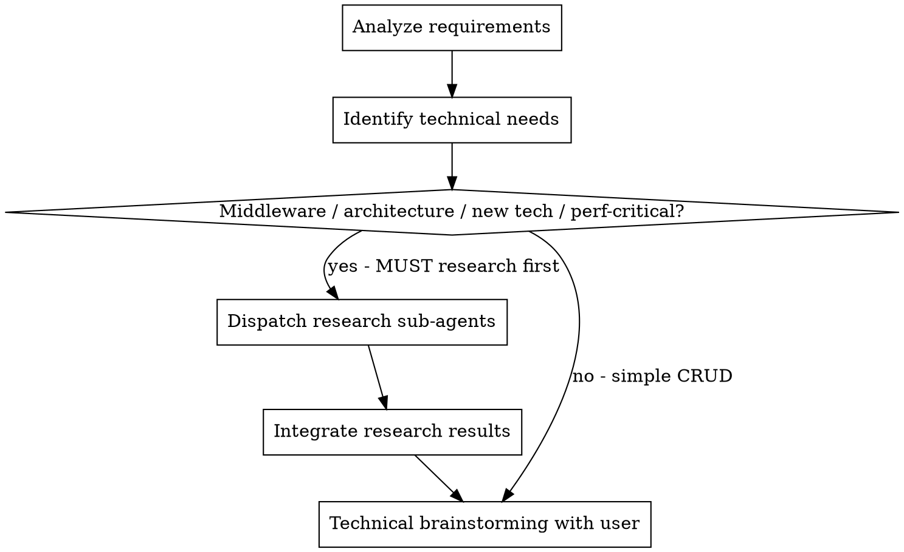
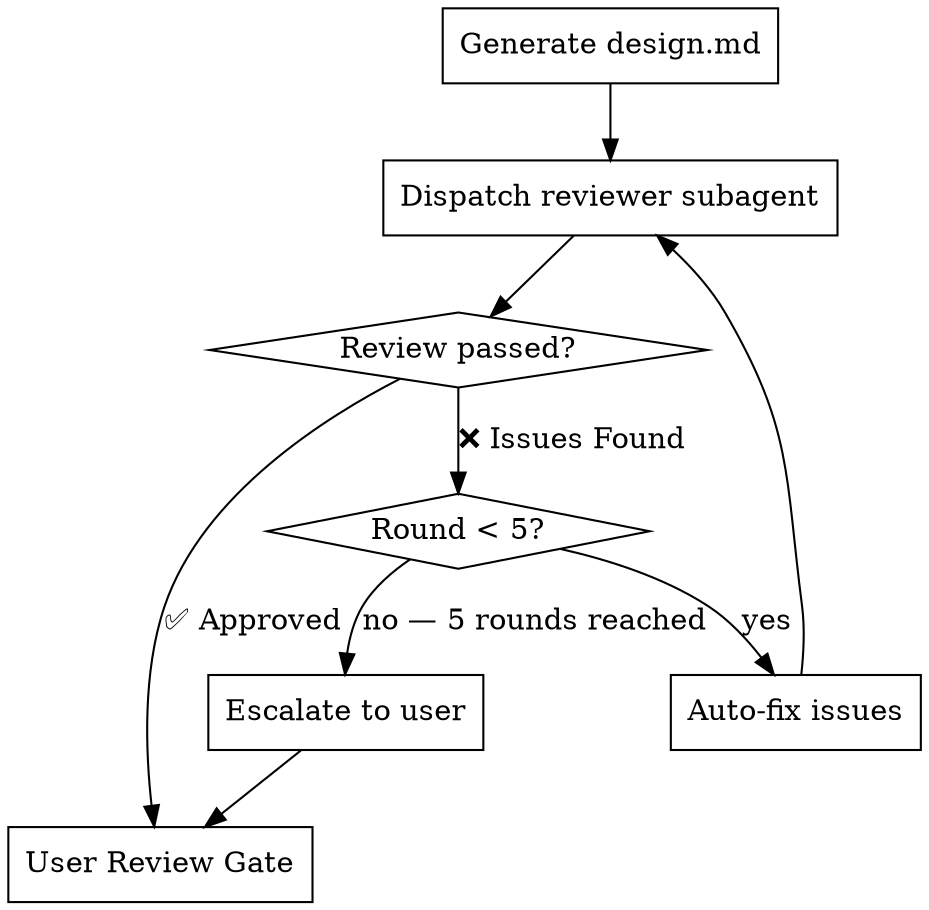

# Detailed Design Generation

## Overview

Conduct detailed technical design for a specified service or frontend application. Deeply uncover potential technical requirements through brainstorming, and automatically dispatch sub-agents for research when encountering technical uncertainties or new technologies.

**Core principle:** Research-augmented design — brainstorm with the user, auto-research unknowns via sub-agents, produce a comprehensive design document.

**Announce at start:** "I'm using the generating-design skill to create the detailed design."

**REQUIRED BACKGROUND:** You MUST understand superpowers:brainstorming before using this skill. That skill defines the dialogue patterns (one question at a time, prefer multiple-choice) this skill reuses for technical brainstorming.

## The Process

### Step 1: Resolve Specs Path

Determine the target specs directory `docs/specs/yyyy-MM-dd-REQ-{id}/{topic}/`:

1. **If the path is already known from the current conversation** (e.g., a prior `/generate-hld` step in this session used a specific specs directory) → use it directly, no confirmation needed.
2. **If the path is NOT known**, scan `docs/specs/` for all `yyyy-MM-dd-REQ-*/{topic}` directories:
   - If none exist → prompt: "No specs directory found. Please run `/prd-clarify` first." and STOP.
   - If exactly one exists → use it directly, no confirmation needed.
   - If multiple exist → present ALL as numbered options, WAIT for user to choose before proceeding.

### Step 2: Load Context

Read exactly these files from the resolved specs path. Do NOT read any other files.

1. `{specs_path}/requirements.md` — skip if already loaded by a prior step in this session
2. `{specs_path}/hld.md` — skip if already loaded by a prior step in this session, or if the file does not exist

Confirm the target service for this design session.

### Step 3: Detect Project Type

Detect the project type by scanning the **working directory root** for characteristic files:

**Frontend signals** (any match → frontend):
- `package.json` exists AND contains frontend framework dependencies (`react`, `vue`, `next`, `nuxt`, `angular`, `svelte`)
- OR config files exist: `vite.config.*`, `next.config.*`, `nuxt.config.*`

**Backend signals** (any match → backend):
- `go.mod`
- `pom.xml` / `build.gradle`
- `requirements.txt` / `pyproject.toml`
- `Cargo.toml`

**Cannot determine** → ask the user.

Announce the detected type: "Detected project type: **frontend/backend**."

### Load Standard Skills (std)

Scan available skills for names containing `std` (e.g., `db-std`, `api-std`, `error-handling-std`). These are standard/specification skills covering design conventions such as database design standards, API design standards, or error handling standards. Load and follow any that match the current design scenario.

### Step 4: Identify Technical Needs and Research

**First, analyze requirements and uncover hidden technical needs from business scenarios:**

**For backend projects:**
- Identify middleware that could enable the feature (e.g., Redis for caching/locking, Elasticsearch for full-text search, Kafka for event-driven flows)
- Identify architectural patterns needed (e.g., data consistency, distributed transactions, CQRS, eventual consistency)
- Do NOT just accept the obvious approach — proactively explore whether introducing the right middleware or pattern could significantly improve the solution

**For frontend projects:**
- Identify UI library/component framework needs (e.g., design system, component library selection)
- Identify state management and data flow patterns (e.g., global store, server state caching, real-time sync)
- Identify performance-critical rendering concerns (e.g., virtualization, code splitting, SSR/SSG)
- Do NOT just accept the obvious approach — proactively explore whether introducing the right library or pattern could significantly improve the solution

**Then, dispatch research sub-agents to gather information BEFORE brainstorming with the user.**

<HARD-GATE>
For ANY of the following technical decisions, you MUST dispatch research sub-agents via superpowers:deep-researching BEFORE presenting options to the user. Do NOT rely on existing knowledge alone — get the latest industry practices and community solutions.

**Backend triggers:**
1. **Middleware selection** — choosing between or introducing middleware (Redis, Elasticsearch, Kafka, RabbitMQ, etc.)
2. **Architecture pattern decisions** — distributed transactions, data consistency, CQRS, event sourcing, saga pattern, etc.

**Frontend triggers:**
3. **UI framework/library selection** — choosing between component libraries, design systems, or UI frameworks
4. **State management decisions** — choosing between state management approaches (Redux, Zustand, Jotai, server state with React Query, etc.)

**Common triggers (both):**
5. **New technology introduction** — any middleware, framework, protocol, or library not currently used in the project
6. **Performance-critical design** — high-throughput, low-latency, large-scale data processing, or complex rendering optimization

You may NOT skip research by claiming "I already know the best practice." The purpose is to get the LATEST community solutions, not to rely on training data.
</HARD-GATE>

**REQUIRED SUB-SKILL:** Use superpowers:deep-researching for all research dispatches.

### Step 5: Technical Brainstorming

Use brainstorming dialogue patterns: one question at a time, prefer multiple-choice.

**Option presentation rules:**
1. **Lead with your recommended option** — place it first, clearly marked as "(recommended)", with a brief justification based on research findings
2. Present research findings as part of each option — include evidence (community practices, benchmarks, trade-offs)
3. **Always include a "Write all options to design.md for team review" choice as the last option.** When selected, do NOT decide — instead write all researched options with their pros/cons/trade-offs into design.md for the team to evaluate and select during review

**For backend projects**, cover these technical dimensions:
- API design (endpoints, contracts, versioning)
- Data model (tables, indexes, migrations)
- Core logic (algorithms, state machines, business rules)
- Dependencies (external services, libraries, infrastructure)
- Error handling (failure modes, retry strategies, circuit breakers)
- Observability (metrics, logging, alerting)
- Testing strategy (unit, integration, edge cases)
- Rollout plan (feature flags, gradual rollout, rollback)

**For frontend projects**, cover these technical dimensions:
- Page & routing design (new/modified pages, route params, access control)
- Component design (shared components, Props interfaces, reuse strategy)
- State & data flow (global state management, data flow direction)
- API integration strategy (API call list, error handling, loading states)
- Performance optimization (animations, virtual lists, lazy loading, code splitting)
- i18n & analytics (translation keys, business event tracking)
- Compatibility & responsiveness (browser compatibility, mobile adaptation)
- Testing strategy (unit tests, E2E tests, visual regression)

### Step 6: Generate Design Document
- **For backend projects:** use `design-template-backend.md` in this skill's directory
- **For frontend projects:** use `design-template-frontend.md` in this skill's directory
- Output content in Chinese, technical terms in English
- Save to `docs/specs/yyyy-MM-dd-REQ-{id}/{topic}/design.md`

### Step 7: Design Review Loop

Generate design.md 后，dispatch detailed-design-document-reviewer subagent 对文档进行自动审查。

1. **Dispatch reviewer subagent** — 使用 `skills/generating-design/design-document-reviewer-prompt.md` 模板，将 `[DESIGN_FILE_PATH]` 替换为 `docs/specs/yyyy-MM-dd-REQ-{id}/{topic}/design.md`，将 `[REQUIREMENTS_FILE_PATH]` 替换为同目录下的 `requirements.md`，通过 Task tool 派遣审查子代理。
2. **处理审查结果：**
   - **Status: ✅ Approved** → 进入 Step 8（User Review Gate）。
   - **Status: ❌ Issues Found** → 根据 Issues 列表自动修复 design.md，修复完成后重新派遣 reviewer subagent 审查。
3. **循环上限：** 修复循环最多 **5 轮**。若 5 轮后仍有未解决的 Issues，停止自动修复，将剩余问题汇总上报给用户，由用户决定是否继续或手动调整。

### Step 8: User Review Gate

审查通过（或用户确认剩余问题可接受）后，提示用户对 design.md 进行最终人工 review。

1. 告知用户：design.md 已通过自动审查（或列出已上报的剩余问题），请 review 文档内容。
2. **等待用户明确确认**（如 "确认" / "approved" / "LGTM"）后才可进入下一步。
3. 如果用户提出修改意见，执行修改后重新提交用户确认，直到获得明确批准。

### Step 9: User Confirmation
- Present complete design for review
- Revise if needed
- Get explicit approval

### Step 10: Prompt Next Step
- "Design complete. Run `/write-plan` to create the implementation plan."

## Integration

**REQUIRED SUB-SKILL:** superpowers:deep-researching (research dispatch)
**REQUIRED BACKGROUND:** superpowers:brainstorming (dialogue patterns)
**Input:** `requirements.md` + `hld.md` (optional) from same specs directory
**Output:** `design.md` in same specs directory
**Next step:** superpowers:writing-plans (via /write-plan)
