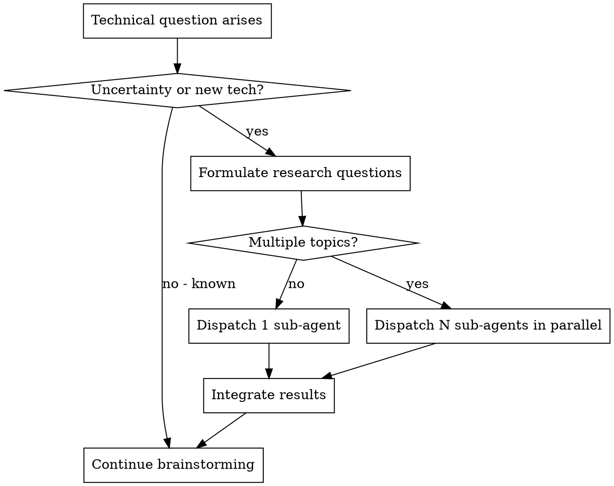

# Detailed Design Generation

## Overview

Conduct detailed technical design for a specified microservice. Deeply uncover potential technical requirements through brainstorming, and automatically dispatch sub-agents for research when encountering technical uncertainties or new technologies.

**Core principle:** Research-augmented design — brainstorm with the user, auto-research unknowns via sub-agents, produce a comprehensive design document.

**Announce at start:** "I'm using the generating-design skill to create the detailed design."

**REQUIRED BACKGROUND:** You MUST understand superpowers:brainstorming before using this skill. That skill defines the dialogue patterns (one question at a time, prefer multiple-choice) this skill reuses for technical brainstorming.

## The Process

### Step 1: Confirm Specs Path

Scan `docs/specs/` and select the most recent `yyyy-MM-dd-REQ-*/{topic}` directory (by date) as the candidate. If no specs directories exist, prompt: "No specs directory found. Please run `/prd-clarify` first." and STOP.

<HARD-GATE>
You MUST present the candidate path to the user and WAIT for their confirmation before doing anything else. Do NOT load files, do NOT start brainstorming, do NOT proceed to Step 2 until the user explicitly confirms.

Say exactly: "I found specs directory: `{candidate_path}`. Is this the correct target? (Y/N)"

Then STOP and wait for user response. Only proceed after user confirms.
</HARD-GATE>

### Step 2: Load Context

After user confirms the specs path:
1. For each context file (`requirements.md`, `hld.md`):
   - If already in the current conversation context (e.g., loaded by a prior step in the same session) → skip file reading
   - If not in context → read from `{specs_path}/` (if the file exists)
2. Confirm the target microservice for this design session

### Step 2: Technical Brainstorming

Use brainstorming dialogue patterns: one question at a time, prefer multiple-choice.

Cover these technical dimensions:
- API design (endpoints, contracts, versioning)
- Data model (tables, indexes, migrations)
- Core logic (algorithms, state machines, business rules)
- Dependencies (external services, libraries, infrastructure)
- Error handling (failure modes, retry strategies, circuit breakers)
- Observability (metrics, logging, alerting)
- Testing strategy (unit, integration, edge cases)
- Rollout plan (feature flags, gradual rollout, rollback)

### Step 3: Auto-Research When Needed

**Trigger conditions for research dispatch:**
1. **Technical uncertainty** — unknown performance limits, compatibility constraints, undocumented behavior
2. **New technology not in the project** — unfamiliar middleware, frameworks, protocols, libraries

**REQUIRED SUB-SKILL:** Use superpowers:deep-researching for all research dispatches.

### Step 4: Generate Design Document
- Use `design-template.md` in this skill's directory
- Output content in Chinese, technical terms in English
- Save to `docs/specs/yyyy-MM-dd-REQ-{id}/{topic}/design.md`

### Step 5: User Confirmation
- Present complete design for review
- Revise if needed
- Get explicit approval

### Step 6: Prompt Next Step
- "Design complete. Run `/write-plan` to create the implementation plan."

## Integration

**REQUIRED SUB-SKILL:** superpowers:deep-researching (research dispatch)
**REQUIRED BACKGROUND:** superpowers:brainstorming (dialogue patterns)
**Input:** `requirements.md` + `hld.md` (optional) from same specs directory
**Output:** `design.md` in same specs directory
**Next step:** superpowers:writing-plans (via /write-plan)
