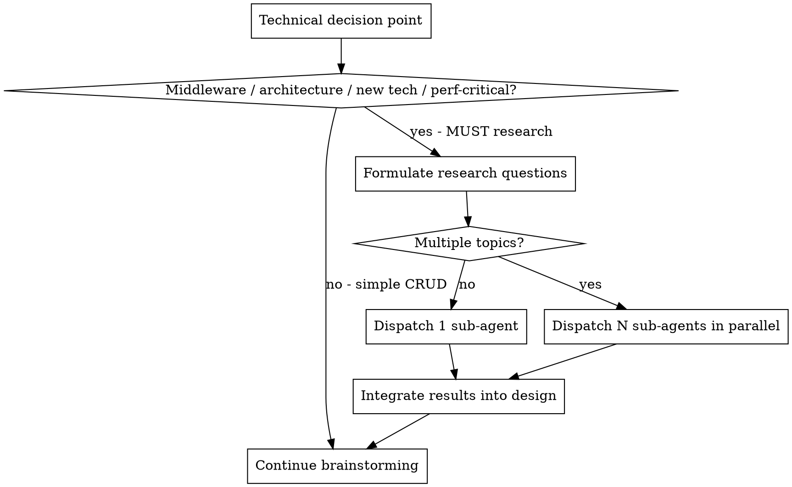

# Detailed Design Generation

## Overview

Conduct detailed technical design for a specified microservice. Deeply uncover potential technical requirements through brainstorming, and automatically dispatch sub-agents for research when encountering technical uncertainties or new technologies.

**Core principle:** Research-augmented design — brainstorm with the user, auto-research unknowns via sub-agents, produce a comprehensive design document.

**Announce at start:** "I'm using the generating-design skill to create the detailed design."

**REQUIRED BACKGROUND:** You MUST understand superpowers:brainstorming before using this skill. That skill defines the dialogue patterns (one question at a time, prefer multiple-choice) this skill reuses for technical brainstorming.

## The Process

### Step 1: Confirm Specs Path

Scan `docs/specs/` for all `yyyy-MM-dd-REQ-*/{topic}` directories, sorted by date (most recent first). If none exist, prompt: "No specs directory found. Please run `/prd-clarify` first." and STOP.

<HARD-GATE>
You MUST present ALL found directories as numbered options and WAIT for the user to choose before doing anything else. Do NOT load files, do NOT start brainstorming, do NOT proceed to Step 2 until the user selects.

Say exactly:
"Found the following specs directories:
1. `{most_recent_path}` (recommended)
2. `{older_path}`
3. ...

Which one to use? (enter number)"

Then STOP and wait for user response. Only proceed after user selects.
</HARD-GATE>

### Step 2: Load Context

After user confirms the specs path:
1. For each context file (`requirements.md`, `hld.md`):
   - If already in the current conversation context (e.g., loaded by a prior step in the same session) → skip file reading
   - If not in context → read from `{specs_path}/` (if the file exists)
2. Confirm the target microservice for this design session

### Step 2: Technical Brainstorming

Use brainstorming dialogue patterns: one question at a time, prefer multiple-choice.

Cover these technical dimensions:
- API design (endpoints, contracts, versioning)
- Data model (tables, indexes, migrations)
- Core logic (algorithms, state machines, business rules)
- Dependencies (external services, libraries, infrastructure)
- Error handling (failure modes, retry strategies, circuit breakers)
- Observability (metrics, logging, alerting)
- Testing strategy (unit, integration, edge cases)
- Rollout plan (feature flags, gradual rollout, rollback)

**During brainstorming, actively uncover hidden technical needs from business scenarios:**
- Identify middleware that could enable the feature (e.g., Redis for caching/locking, Elasticsearch for full-text search, Kafka for event-driven flows)
- Identify architectural patterns needed (e.g., data consistency, distributed transactions, CQRS, eventual consistency)
- Do NOT just accept the obvious approach — proactively explore whether introducing the right middleware or pattern could significantly improve the solution

### Step 3: Mandatory Technical Research

<HARD-GATE>
For ANY of the following technical decisions, you MUST dispatch research sub-agents via superpowers:deep-researching. Do NOT rely on existing knowledge alone — get the latest industry practices and community solutions.

**Mandatory research triggers:**
1. **Middleware selection** — choosing between or introducing middleware (Redis, Elasticsearch, Kafka, RabbitMQ, etc.)
2. **Architecture pattern decisions** — distributed transactions, data consistency, CQRS, event sourcing, saga pattern, etc.
3. **New technology introduction** — any middleware, framework, protocol, or library not currently used in the project
4. **Performance-critical design** — when the solution involves high-throughput, low-latency, or large-scale data processing

You may NOT skip research by claiming "I already know the best practice." The purpose is to get the LATEST community solutions, not to rely on training data.
</HARD-GATE>

**REQUIRED SUB-SKILL:** Use superpowers:deep-researching for all research dispatches.

### Step 4: Generate Design Document
- Use `design-template.md` in this skill's directory
- Output content in Chinese, technical terms in English
- Save to `docs/specs/yyyy-MM-dd-REQ-{id}/{topic}/design.md`

### Step 5: User Confirmation
- Present complete design for review
- Revise if needed
- Get explicit approval

### Step 6: Prompt Next Step
- "Design complete. Run `/write-plan` to create the implementation plan."

## Integration

**REQUIRED SUB-SKILL:** superpowers:deep-researching (research dispatch)
**REQUIRED BACKGROUND:** superpowers:brainstorming (dialogue patterns)
**Input:** `requirements.md` + `hld.md` (optional) from same specs directory
**Output:** `design.md` in same specs directory
**Next step:** superpowers:writing-plans (via /write-plan)
