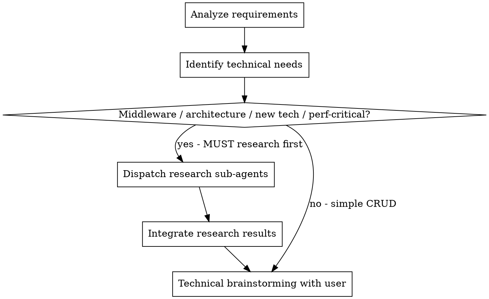
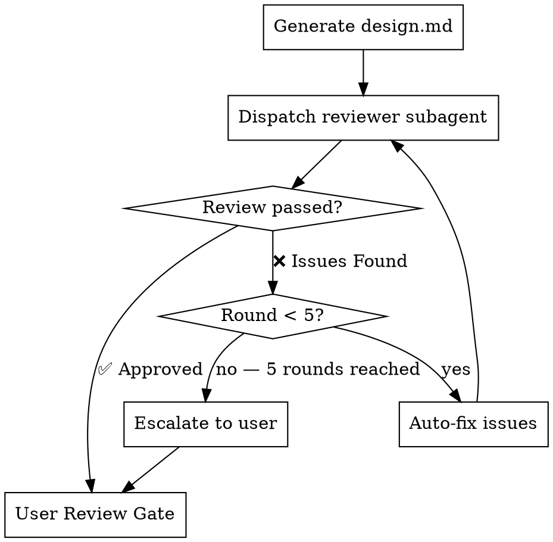

# 详细设计生成

## 概述

针对指定服务或前端应用进行详细技术设计。通过头脑风暴深入发掘潜在的技术需求，遇到技术不确定性或新技术时自动派发 sub-agent 进行调研。

**核心原则：** 调研增强的设计 —— 与用户进行头脑风暴，通过 sub-agent 自动调研未知领域，产出完整的设计文档。

**启动时宣告：** "I'm using the generating-design skill to create the detailed design."

**前置要求：** 在使用本技能之前，你必须理解 superpowers:brainstorming。该技能定义了本技能复用的对话模式（每次一个问题、优先多选题）以进行技术头脑风暴。

## 流程

### 步骤 1：确定 Specs 路径

确定目标 specs 目录 `docs/specs/yyyy-MM-dd-REQ-{id}/{topic}/`：

1. **如果当前对话中已明确知道路径**（例如，同一会话中前序的 `/generate-hld` 步骤使用了特定的 specs 目录） → 直接使用，无需确认。
2. **如果路径未知**，扫描 `docs/specs/` 下所有 `yyyy-MM-dd-REQ-*/{topic}` 目录：
   - 如果不存在 → 提示："未找到 specs 目录，请先执行 `/prd-clarify` 创建需求文档。"并停止。
   - 如果只有一个 → 直接使用，无需确认。
   - 如果有多个 → 以编号列表形式展示所有目录，等待用户选择后才能继续。

### 步骤 2：加载上下文

从确定的 specs 路径中精确读取以下文件，不得读取其他文件。

1. `{specs_path}/requirements.md` —— 如果同一会话中前序步骤已加载过，可跳过
2. `{specs_path}/hld.md` —— 如果同一会话中前序步骤已加载过可跳过，或文件不存在则跳过

确认本次设计会话的目标服务。

### 步骤 3：检测项目类型

通过扫描**工作目录根路径**的特征文件来检测项目类型：

**前端项目信号**（任一匹配 → 前端）：
- `package.json` 存在且包含前端框架依赖（`react`、`vue`、`next`、`nuxt`、`angular`、`svelte`）
- 或存在配置文件：`vite.config.*`、`next.config.*`、`nuxt.config.*`

**后端项目信号**（任一匹配 → 后端）：
- `go.mod`
- `pom.xml` / `build.gradle`
- `requirements.txt` / `pyproject.toml`
- `Cargo.toml`

**无法确定** → 询问用户。

宣告检测结果："Detected project type: **frontend/backend**."

### 加载规范 Skills（std）

扫描可用的 skills 列表，查找名称中包含 `std` 的 skill（如 `db-std`、`api-std`、`error-handling-std`）。这些是各类规范/标准 skill，涵盖数据库设计规范、API 设计规范、错误处理规范等。根据当前设计场景选择性加载并遵循相应规范。

### 步骤 4：识别技术需求并调研

**首先，分析需求并从业务场景中挖掘潜在技术需求：**

**后端项目：**
- 识别能够支撑功能的中间件（如：Redis 用于缓存/分布式锁、Elasticsearch 用于全文搜索、Kafka 用于事件驱动流程）
- 识别所需的架构模式（如：数据一致性、分布式事务、CQRS、最终一致性）
- 不要仅接受显而易见的方案——主动探索引入合适的中间件或模式是否能显著改善解决方案

**前端项目：**
- 识别 UI 库/组件框架需求（如：设计系统、组件库选型）
- 识别状态管理与数据流模式（如：全局 store、服务端状态缓存、实时同步）
- 识别性能关键的渲染关注点（如：虚拟化、代码分割、SSR/SSG）
- 不要仅接受显而易见的方案——主动探索引入合适的库或模式是否能显著改善解决方案

**然后，在与用户进行头脑风暴之前，先派遣调研子代理收集信息。**

<HARD-GATE>
对于以下任何技术决策，必须在向用户展示选项之前，通过 superpowers:deep-researching 派遣调研子代理。不得仅依赖已有知识——必须获取最新的行业实践和社区方案。

**后端触发条件：**
1. **中间件选型** —— 选择或引入中间件（Redis、Elasticsearch、Kafka、RabbitMQ 等）
2. **架构模式决策** —— 分布式事务、数据一致性、CQRS、Event Sourcing、Saga 模式等

**前端触发条件：**
3. **UI 框架/库选型** —— 选择组件库、设计系统或 UI 框架
4. **状态管理决策** —— 选择状态管理方案（Redux、Zustand、Jotai、React Query 的服务端状态等）

**通用触发条件（前后端均适用）：**
5. **引入新技术** —— 项目中当前未使用的任何中间件、框架、协议或库
6. **性能关键设计** —— 涉及高吞吐、低延迟、大规模数据处理或复杂渲染优化的方案

不得以"我已知道最佳实践"为由跳过调研。目的是获取最新的社区方案，而非依赖训练数据。
</HARD-GATE>

**必需子技能：** 使用 superpowers:deep-researching 执行所有调研派发。

### 步骤 5：技术头脑风暴

使用头脑风暴对话模式：每次一个问题，优先多选题。

**选项呈现规则：**
1. **推荐选项放在首位** —— 明确标记为"（推荐）"，并基于调研结果简要说明推荐理由
2. 将调研结果作为每个选项的一部分呈现——包含证据（社区实践、性能基准、权衡分析）
3. **最后一个选项始终为"将所有方案写入 design.md 供团队评审选型"。** 用户选择该选项时，不做决策——将所有调研到的方案及其优缺点、权衡分析写入 design.md，由团队在评审时评估选择

**后端项目**，覆盖以下技术维度：
- API 设计（端点、契约、版本控制）
- 数据模型（表、索引、迁移）
- 核心逻辑（算法、状态机、业务规则）
- 依赖项（外部服务、库、基础设施）
- 错误处理（故障模式、重试策略、熔断器）
- 可观测性（指标、日志、告警）
- 测试策略（单元测试、集成测试、边界用例）
- 发布计划（Feature Flag、灰度发布、回滚方案）

**前端项目**，覆盖以下技术维度：
- 页面与路由设计（新增/修改页面、路由参数、访问控制）
- 组件设计（共享组件、Props 接口、复用策略）
- 状态与数据流（全局状态管理、数据流向）
- 接口对接策略（接口调用清单、错误处理、加载状态）
- 性能优化（动画、虚拟列表、懒加载、代码分割）
- 国际化与埋点（翻译 key、业务事件埋点）
- 兼容性与响应式（浏览器兼容性、移动端适配）
- 测试策略（单元测试、E2E 测试、视觉回归测试）

### 步骤 6：生成设计文档
- **后端项目：** 使用本技能目录下的 `design-template-backend.md`
- **前端项目：** 使用本技能目录下的 `design-template-frontend.md`
- 内容用中文输出，技术术语用英文
- 保存到 `docs/specs/yyyy-MM-dd-REQ-{id}/{topic}/design.md`

### 步骤 7：Design Review Loop

生成 design.md 后，dispatch design-document-reviewer subagent 对文档进行自动审查。

1. **Dispatch reviewer subagent** —— 使用 `skills/brainstorming/design-document-reviewer-prompt.md` 模板，将 `[DESIGN_FILE_PATH]` 替换为 `docs/specs/yyyy-MM-dd-REQ-{id}/{topic}/design.md`，通过 Task tool 派遣审查子代理。
2. **处理审查结果：**
   - **Status: ✅ Approved** → 进入步骤 8（User Review Gate）。
   - **Status: ❌ Issues Found** → 根据 Issues 列表自动修复 design.md，修复完成后重新派遣 reviewer subagent 审查。
3. **循环上限：** 修复循环最多 **5 轮**。若 5 轮后仍有未解决的 Issues，停止自动修复，将剩余问题汇总上报给用户，由用户决定是否继续或手动调整。

### 步骤 8：User Review Gate

审查通过（或用户确认剩余问题可接受）后，提示用户对 design.md 进行最终人工 review。

1. 告知用户：design.md 已通过自动审查（或列出已上报的剩余问题），请 review 文档内容。
2. **等待用户明确确认**（如"确认" / "approved" / "LGTM"）后才可进入下一步。
3. 如果用户提出修改意见，执行修改后重新提交用户确认，直到获得明确批准。

### 步骤 9：用户确认
- 展示完整设计供审阅
- 如有需要进行修订
- 获得明确批准

### 步骤 10：提示下一步
- "Design complete. Run `/write-plan` to create the implementation plan."

## 集成关系

**必需子技能：** superpowers:deep-researching（调研派发）
**前置要求：** superpowers:brainstorming（对话模式）
**输入：** 同一规格目录下的 `requirements.md` + `hld.md`（可选）
**输出：** 同一规格目录下的 `design.md`
**后续步骤：** superpowers:writing-plans（通过 /write-plan）
