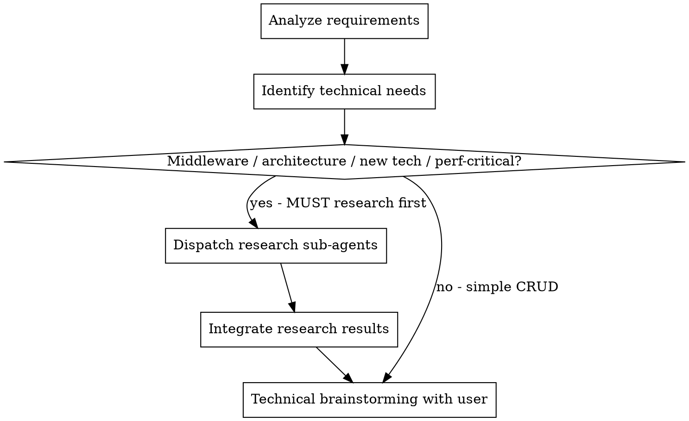

# 详细设计生成

## 概述

针对指定微服务进行详细技术设计。通过头脑风暴深入发掘潜在的技术需求，遇到技术不确定性或新技术时自动派发 sub-agent 进行调研。

**核心原则：** 调研增强的设计 —— 与用户进行头脑风暴，通过 sub-agent 自动调研未知领域，产出完整的设计文档。

**启动时宣告：** "I'm using the generating-design skill to create the detailed design."

**前置要求：** 在使用本技能之前，你必须理解 superpowers:brainstorming。该技能定义了本技能复用的对话模式（每次一个问题、优先多选题）以进行技术头脑风暴。

## 流程

### 步骤 1：确认 Specs 路径

扫描 `docs/specs/` 下所有 `yyyy-MM-dd-REQ-*/{topic}` 目录，按日期倒序排列。如果不存在 specs 目录，提示："未找到 specs 目录，请先执行 `/prd-clarify` 创建需求文档。"并停止。

<HARD-GATE>
必须将所有找到的目录以编号列表形式展示给用户，等待用户选择后才能继续。不得加载文件、不得开始头脑风暴、不得进入步骤 2。

必须说：
"找到以下 specs 目录：
1. `{最近的路径}` （推荐）
2. `{较早的路径}`
3. ...

请选择使用哪个？（输入编号）"

然后停止并等待用户回复。只有用户选择后才能继续。
</HARD-GATE>

### 步骤 2：加载上下文

用户确认 specs 路径后：
1. 对于每个上下文文件（`requirements.md`、`hld.md`）：
   - 如果已在当前对话上下文中（例如，在同一会话中由前序步骤加载过） → 跳过文件读取
   - 如果不在上下文中 → 从 `{specs_path}/` 读取（如果文件存在）
2. 确认本次设计会话的目标微服务

### 步骤 3：识别技术需求并调研

**首先，分析需求并从业务场景中挖掘潜在技术需求：**
- 识别能够支撑功能的中间件（如：Redis 用于缓存/分布式锁、Elasticsearch 用于全文搜索、Kafka 用于事件驱动流程）
- 识别所需的架构模式（如：数据一致性、分布式事务、CQRS、最终一致性）
- 不要仅接受显而易见的方案——主动探索引入合适的中间件或模式是否能显著改善解决方案

**然后，在与用户进行头脑风暴之前，先派遣调研子代理收集信息。**

<HARD-GATE>
对于以下任何技术决策，必须在向用户展示选项之前，通过 superpowers:deep-researching 派遣调研子代理。不得仅依赖已有知识——必须获取最新的行业实践和社区方案。

**强制调研触发条件：**
1. **中间件选型** —— 选择或引入中间件（Redis、Elasticsearch、Kafka、RabbitMQ 等）
2. **架构模式决策** —— 分布式事务、数据一致性、CQRS、Event Sourcing、Saga 模式等
3. **引入新技术** —— 项目中当前未使用的任何中间件、框架、协议或库
4. **性能关键设计** —— 涉及高吞吐、低延迟或大规模数据处理的方案

不得以"我已知道最佳实践"为由跳过调研。目的是获取最新的社区方案，而非依赖训练数据。
</HARD-GATE>

**必需子技能：** 使用 superpowers:deep-researching 执行所有调研派发。

### 步骤 4：技术头脑风暴

使用头脑风暴对话模式：每次一个问题，优先多选题。

**选项呈现规则：**
1. **推荐选项放在首位** —— 明确标记为"（推荐）"，并基于调研结果简要说明推荐理由
2. 将调研结果作为每个选项的一部分呈现——包含证据（社区实践、性能基准、权衡分析）
3. **最后一个选项始终为"将所有方案写入 design.md 供团队评审选型"。** 用户选择该选项时，不做决策——将所有调研到的方案及其优缺点、权衡分析写入 design.md，由团队在评审时评估选择

覆盖以下技术维度：
- API 设计（端点、契约、版本控制）
- 数据模型（表、索引、迁移）
- 核心逻辑（算法、状态机、业务规则）
- 依赖项（外部服务、库、基础设施）
- 错误处理（故障模式、重试策略、熔断器）
- 可观测性（指标、日志、告警）
- 测试策略（单元测试、集成测试、边界用例）
- 发布计划（Feature Flag、灰度发布、回滚方案）

### 步骤 4：生成设计文档
- 使用本技能目录下的 `design-template.md`
- 内容用中文输出，技术术语用英文
- 保存到 `docs/specs/yyyy-MM-dd-REQ-{id}/{topic}/design.md`

### 步骤 5：用户确认
- 展示完整设计供审阅
- 如有需要进行修订
- 获得明确批准

### 步骤 6：提示下一步
- "Design complete. Run `/write-plan` to create the implementation plan."

## 集成关系

**必需子技能：** superpowers:deep-researching（调研派发）
**前置要求：** superpowers:brainstorming（对话模式）
**输入：** 同一规格目录下的 `requirements.md` + `hld.md`（可选）
**输出：** 同一规格目录下的 `design.md`
**后续步骤：** superpowers:writing-plans（通过 /write-plan）
