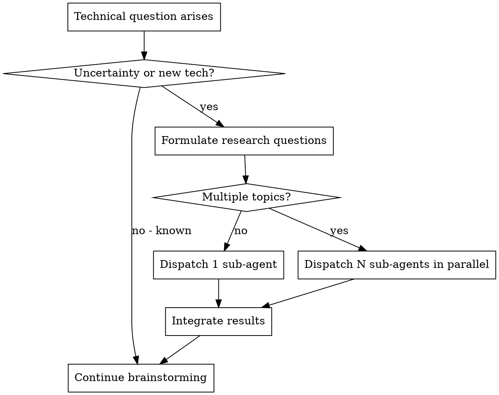

# 详细设计生成

## 概述

针对指定微服务进行详细技术设计。通过头脑风暴深入发掘潜在的技术需求，遇到技术不确定性或新技术时自动派发 sub-agent 进行调研。

**核心原则：** 调研增强的设计 —— 与用户进行头脑风暴，通过 sub-agent 自动调研未知领域，产出完整的设计文档。

**启动时宣告：** "I'm using the generating-design skill to create the detailed design."

**前置要求：** 在使用本技能之前，你必须理解 superpowers:brainstorming。该技能定义了本技能复用的对话模式（每次一个问题、优先多选题）以进行技术头脑风暴。

## 流程

### 步骤 1：确定 Specs 路径并加载上下文
1. 确定 specs 目录路径 `docs/specs/yyyy-MM-dd-REQ-{id}/{topic}/`：
   - 如果在同一会话中由 `/generate-hld` 之后调用，路径已知
   - 如果未知，扫描 `docs/specs/` 并选取日期最近的 `yyyy-MM-dd-REQ-*` 目录，展示给用户确认
   - 如果不存在 specs 目录，提示："未找到 specs 目录，请先执行 `/prd-clarify` 创建需求文档。"
2. 对于每个上下文文件（`requirements.md`、`hld.md`）：
   - 如果已在当前对话上下文中（例如，在同一会话中由前序步骤加载过） → 跳过文件读取
   - 如果不在上下文中 → 从 `{specs_path}/` 读取（如果文件存在）
3. 确认本次设计会话的目标微服务

### 步骤 2：技术头脑风暴

使用头脑风暴对话模式：每次一个问题，优先多选题。

覆盖以下技术维度：
- API 设计（端点、契约、版本控制）
- 数据模型（表、索引、迁移）
- 核心逻辑（算法、状态机、业务规则）
- 依赖项（外部服务、库、基础设施）
- 错误处理（故障模式、重试策略、熔断器）
- 可观测性（指标、日志、告警）
- 测试策略（单元测试、集成测试、边界用例）
- 发布计划（Feature Flag、灰度发布、回滚方案）

### 步骤 3：按需自动调研

**触发调研派发的条件：**
1. **技术不确定性** —— 未知的性能上限、兼容性约束、未文档化的行为
2. **项目中不存在的新技术** —— 不熟悉的中间件、框架、协议、库

**必需子技能：** 使用 superpowers:deep-researching 执行所有调研派发。

### 步骤 4：生成设计文档
- 使用本技能目录下的 `design-template.md`
- 内容用中文输出，技术术语用英文
- 保存到 `docs/specs/yyyy-MM-dd-REQ-{id}/{topic}/design.md`

### 步骤 5：用户确认
- 展示完整设计供审阅
- 如有需要进行修订
- 获得明确批准

### 步骤 6：提示下一步
- "Design complete. Run `/write-plan` to create the implementation plan."

## 集成关系

**必需子技能：** superpowers:deep-researching（调研派发）
**前置要求：** superpowers:brainstorming（对话模式）
**输入：** 同一规格目录下的 `requirements.md` + `hld.md`（可选）
**输出：** 同一规格目录下的 `design.md`
**后续步骤：** superpowers:writing-plans（通过 /write-plan）
