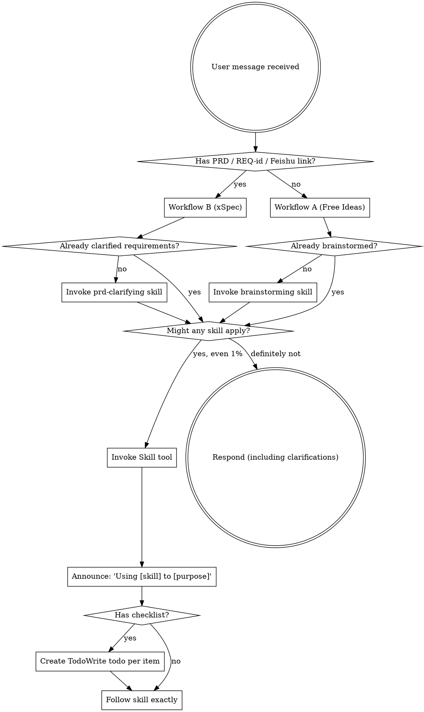

<EXTREMELY-IMPORTANT>
If you think there is even a 1% chance a skill might apply to what you are doing, you ABSOLUTELY MUST invoke the skill.

IF A SKILL APPLIES TO YOUR TASK, YOU DO NOT HAVE A CHOICE. YOU MUST USE IT.

This is not negotiable. This is not optional. You cannot rationalize your way out of this.
</EXTREMELY-IMPORTANT>

## How to Access Skills

**In Claude Code:** Use the `Skill` tool. When you invoke a skill, its content is loaded and presented to you—follow it directly. Never use the Read tool on skill files.

**In other environments:** Check your platform's documentation for how skills are loaded.

# Two Parallel Workflows

This project runs two parallel workflows. The agent MUST route to the correct one before doing anything.

```
Workflow A (Free Ideas):
  /brainstorm → /write-plan → /execute-plan

Workflow B (PRD-Driven / xSpec):
  /prd-clarify → /generate-hld (optional) → /generate-design → /write-plan → /execute-plan
```

## Routing Rules

| Signal | Workflow | First Skill |
|--------|----------|-------------|
| PRD document provided | B (xSpec) | `prd-clarifying` |
| REQ-id mentioned (e.g., REQ-12345) | B (xSpec) | `prd-clarifying` |
| Feishu link (`project.feishu.cn/.*/detail/\d+`) | B (xSpec) | `prd-clarifying` |
| `docs/specs/` directory with requirements.md exists | B (xSpec) | Resume from current stage |
| Free idea, feature request, or improvement | A (Free Ideas) | `brainstorming` |
| Bug fix, refactoring, exploration | A (Free Ideas) | `brainstorming` |
| Ambiguous — cannot determine | — | Ask user which workflow |

**Key difference:** Workflow A uses `brainstorming` for open-ended exploration. Workflow B uses `prd-clarifying` for structured requirement clarification.

# Using Skills

## The Rule

**Invoke relevant or requested skills BEFORE any response or action.** Even a 1% chance a skill might apply means that you should invoke the skill to check. If an invoked skill turns out to be wrong for the situation, you don't need to use it.



## Red Flags

These thoughts mean STOP—you're rationalizing:

| Thought | Reality |
|---------|---------|
| "Let me just start coding" | Follow the workflow. Route first, then follow the skill chain. |
| "The PRD is clear enough" | Business assumptions hide in every PRD. Clarify first. |
| "This is just a free idea, skip /brainstorm" | Workflow A requires brainstorming. No shortcuts. |
| "I need more context first" | Skill check comes BEFORE clarifying questions. |
| "I know the best tech approach" | Research latest practices. Don't rely on training data. |
| "Let me explore the codebase first" | Skills tell you HOW to explore. Check first. |
| "I'll test manually later" | testing.md is generated upfront and runs automatically. |
| "This testing.md case is wrong" | Do NOT modify it. Stop and report to user. |
| "The external DB is probably fine" | Check localhost. Non-local = ask user first. |
| "This doesn't need the full workflow" | If a PRD or REQ-id exists, use Workflow B. Otherwise use Workflow A. |
| "I'll just do this one thing first" | Check BEFORE doing anything. |
| "The skill is overkill" | Simple things become complex. Use it. |
| "I remember this skill" | Skills evolve. Read current version. |

## Skill Priority

When multiple skills could apply, use this order:

1. **Workflow skills first** (prd-clarifying, generating-hld, generating-design, brainstorming) — these determine WHAT to build
2. **Planning skills second** (writing-plans) — these determine HOW to build
3. **Execution skills third** (executing-plans) — these carry out the plan

"Here's a PRD" → Workflow B: /prd-clarify first, then design, then plan.
"I want to add X" → Workflow A: /brainstorm first, then plan.
"Design is ready" → /write-plan first, then execute.

## Skill Types

**Rigid** (prd-clarifying, executing-plans): Follow exactly. Don't adapt away discipline.

**Flexible** (generating-design, deep-researching, brainstorming): Adapt research and brainstorming to context.

The skill itself tells you which.

## User Instructions

Instructions say WHAT, not HOW. "Implement this PRD" or "Design this feature" doesn't mean skip workflows.

## Workflows

### Workflow A — Free Ideas

```
/brainstorm → /write-plan → /execute-plan
```

| Command | Skill | Output |
|---------|-------|--------|
| `/brainstorm` | `brainstorming` | Explored requirements + design direction |
| `/write-plan` | `writing-plans` | `plan.md` |
| `/execute-plan` | `executing-plans` | Implementation code |

Use when: free ideas, feature requests, improvements, bug fixes, refactoring, exploration — anything without a formal PRD or REQ-id.

### Workflow B — PRD-Driven (xSpec)

```
/prd-clarify → /generate-hld (optional) → /generate-design → /write-plan → /execute-plan
```

| Command | Skill | Output |
|---------|-------|--------|
| `/prd-clarify` | `prd-clarifying` | `requirements.md` |
| `/generate-hld` | `generating-hld` | `hld.md` |
| `/generate-design` | `generating-design` | `design.md` |
| `/write-plan` | `writing-plans` | `plan.md` + `testing.md` |
| `/execute-plan` | `executing-plans` | Implementation + test verification |

Use when: formal PRD, REQ-id, Feishu requirement link, or any task that needs structured requirement clarification.
