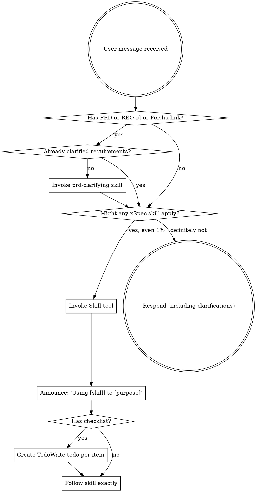

<EXTREMELY-IMPORTANT>
如果你认为哪怕有 1% 的可能性某个 xSpec skill 适用于你正在做的事情，你绝对必须调用该 skill。

如果某个 XSPEC SKILL 适用于你的任务，你没有选择。你必须使用它。

这不可商量。这不是可选的。你不能为跳过找借口。
</EXTREMELY-IMPORTANT>

## 如何访问 Skill

**在 Claude Code 中：** 使用 `Skill` 工具。当你调用一个 skill 时，其内容会被加载并展示给你——直接遵循它。永远不要使用 Read 工具读取 skill 文件。

**在其他环境中：** 查看你平台的文档了解 skill 如何加载。

# 使用 xSpec Skill

## 规则

**在任何回复或操作之前，先调用相关的 xSpec skill。** 即使只有 1% 的可能性某个 skill 适用，你也应该调用它来检查。如果调用的 skill 最终不适合当前情况，你不需要使用它。



## 危险信号

以下想法意味着停下——你在找借口：

| 想法 | 现实 |
|------|------|
| "让我直接开始写代码" | 遵循工作流。有 PRD 先 /prd-clarify。 |
| "PRD 已经够清楚了" | 每份 PRD 都藏着业务假设。先澄清。 |
| "我需要先了解更多上下文" | Skill 检查在澄清问题之前。 |
| "我知道最佳技术方案" | 调研最新实践。不要依赖训练数据。 |
| "让我先探索代码库" | Skill 告诉你如何探索。先检查。 |
| "我之后手动测试" | testing.md 提前生成，自动运行。 |
| "这个测试用例写错了" | 不得修改。停下来向用户反馈。 |
| "外部数据库应该没问题" | 检查 localhost。非本地 = 先问用户。 |
| "这个不需要完整工作流" | 如果有 PRD 或 REQ-id，就用工作流。 |
| "让我先做完这一件事" | 做任何事之前先检查。 |
| "这个 skill 太重了" | 简单的事情会变复杂。使用它。 |
| "我记得这个 skill" | Skill 会演进。读取当前版本。 |

## Skill 优先级

当多个 xSpec skill 可能适用时，按以下顺序使用：

1. **工作流 skill 优先**（prd-clarifying、generating-hld、generating-design）——决定构建什么
2. **计划 skill 其次**（writing-plans）——决定如何构建
3. **执行 skill 最后**（executing-plans）——执行计划

"这是一份 PRD" → 先 /prd-clarify，然后设计，然后计划。
"设计已完成" → 先 /write-plan，然后执行。

## Skill 类型

**刚性**（prd-clarifying、executing-plans）：严格遵循。不要偏离纪律。

**柔性**（generating-design、deep-researching）：根据上下文调整调研和头脑风暴。

Skill 本身会告诉你它属于哪种。

## 用户指令

指令说的是做什么，不是怎么做。"实现这个 PRD" 或 "设计这个功能" 不意味着跳过工作流。

## xSpec 规范

- **Commit 信息：** 前缀 `REQ-{id}`（如 `REQ-12345 feat: add order validation`）
- **代码注释：** 所有注释携带 `// REQ-{id} {说明}`
- **需求 ID：** 从 `https://project.feishu.cn/.*/detail/(\d+)` 提取，或询问用户
- **Specs 目录：** `docs/specs/yyyy-MM-dd-REQ-{id}/{topic}/`

## xSpec 工作流

```
/prd-clarify → /generate-hld(可选) → /generate-design → /write-plan → /execute-plan
```

| 命令 | Skill | 产出 |
|------|-------|------|
| `/prd-clarify` | `prd-clarifying` | `requirements.md` |
| `/generate-hld` | `generating-hld` | `hld.md` |
| `/generate-design` | `generating-design` | `design.md` |
| `/write-plan` | `writing-plans` | `plan.md` + `testing.md` |
| `/execute-plan` | `executing-plans` | 实现代码 + 测试验证 |
