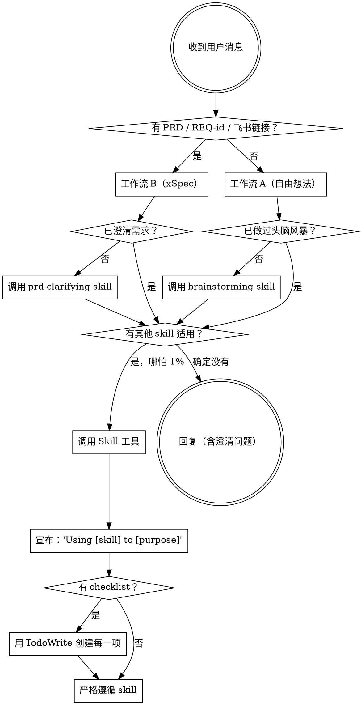

<EXTREMELY-IMPORTANT>
如果你认为哪怕有 1% 的可能性某个 skill 适用于你正在做的事情，你绝对必须调用该 skill。

如果某个 SKILL 适用于你的任务，你没有选择。你必须使用它。

这不可商量。这不是可选的。你不能为跳过找借口。
</EXTREMELY-IMPORTANT>

## 如何访问 Skill

**在 Claude Code 中：** 使用 `Skill` 工具。当你调用一个 skill 时，其内容会被加载并展示给你——直接遵循它。永远不要使用 Read 工具读取 skill 文件。

**在其他环境中：** 查看你平台的文档了解 skill 如何加载。

# 两条并行工作流

本项目运行两条并行工作流。Agent 必须先路由到正确的工作流，再执行任何操作。

```
工作流 A（自由想法）:
  /brainstorm → /write-plan → /execute-plan

工作流 B（PRD 驱动产研流程 / xSpec）:
  /prd-clarify → /generate-hld(可选) → /generate-design → /write-plan → /execute-plan
```

## 路由规则

| 信号 | 工作流 | 首个 Skill |
|------|--------|-----------|
| 提供了 PRD 文档 | B（xSpec） | `prd-clarifying` |
| 提及了 REQ-id（如 REQ-12345） | B（xSpec） | `prd-clarifying` |
| 飞书链接（`project.feishu.cn/.*/detail/\d+`） | B（xSpec） | `prd-clarifying` |
| `docs/specs/` 目录下已有 requirements.md | B（xSpec） | 从当前阶段继续 |
| 自由想法、功能需求、改进建议 | A（自由想法） | `brainstorming` |
| Bug 修复、重构、探索 | A（自由想法） | `brainstorming` |
| 无法判断 | — | 询问用户选择哪条工作流 |

**关键区别：** 工作流 A 使用 `brainstorming` 进行开放式探索。工作流 B 使用 `prd-clarifying` 进行结构化需求澄清。

# 使用 Skill

## 规则

**在任何回复或操作之前，先调用相关的 skill。** 即使只有 1% 的可能性某个 skill 适用，你也应该调用它来检查。如果调用的 skill 最终不适合当前情况，你不需要使用它。



## 危险信号

以下想法意味着停下——你在找借口：

| 想法 | 现实 |
|------|------|
| "让我直接开始写代码" | 遵循工作流。先路由，再按 skill 链执行。 |
| "PRD 已经够清楚了" | 每份 PRD 都藏着业务假设。先澄清。 |
| "这只是个自由想法，跳过 /brainstorm" | 工作流 A 要求头脑风暴。没有捷径。 |
| "我需要先了解更多上下文" | Skill 检查在澄清问题之前。 |
| "我知道最佳技术方案" | 调研最新实践。不要依赖训练数据。 |
| "让我先探索代码库" | Skill 告诉你如何探索。先检查。 |
| "我之后手动测试" | testing.md 提前生成，自动运行。 |
| "这个测试用例写错了" | 不得修改。停下来向用户反馈。 |
| "外部数据库应该没问题" | 检查 localhost。非本地 = 先问用户。 |
| "这个不需要完整工作流" | 有 PRD 或 REQ-id 就用工作流 B，否则用工作流 A。 |
| "让我先做完这一件事" | 做任何事之前先检查。 |
| "这个 skill 太重了" | 简单的事情会变复杂。使用它。 |
| "我记得这个 skill" | Skill 会演进。读取当前版本。 |

## Skill 优先级

当多个 skill 可能适用时，按以下顺序使用：

1. **工作流 skill 优先**（prd-clarifying、generating-hld、generating-design、brainstorming）——决定构建什么
2. **计划 skill 其次**（writing-plans）——决定如何构建
3. **执行 skill 最后**（executing-plans）——执行计划

"这是一份 PRD" → 工作流 B：先 /prd-clarify，然后设计，然后计划。
"我想加个 X 功能" → 工作流 A：先 /brainstorm，然后计划。
"设计已完成" → 先 /write-plan，然后执行。

## Skill 类型

**刚性**（prd-clarifying、executing-plans）：严格遵循。不要偏离纪律。

**柔性**（generating-design、deep-researching、brainstorming）：根据上下文调整调研和头脑风暴。

Skill 本身会告诉你它属于哪种。

## 用户指令

指令说的是做什么，不是怎么做。"实现这个 PRD" 或 "设计这个功能" 不意味着跳过工作流。

## 工作流详情

### 工作流 A — 自由想法

```
/brainstorm → /write-plan → /execute-plan
```

| 命令 | Skill | 产出 |
|------|-------|------|
| `/brainstorm` | `brainstorming` | 探索后的需求 + 设计方向 |
| `/write-plan` | `writing-plans` | `plan.md` |
| `/execute-plan` | `executing-plans` | 实现代码 |

适用场景：自由想法、功能需求、改进建议、Bug 修复、重构、探索——任何没有正式 PRD 或 REQ-id 的任务。

### 工作流 B — PRD 驱动（xSpec）

```
/prd-clarify → /generate-hld(可选) → /generate-design → /write-plan → /execute-plan
```

| 命令 | Skill | 产出 |
|------|-------|------|
| `/prd-clarify` | `prd-clarifying` | `requirements.md` |
| `/generate-hld` | `generating-hld` | `hld.md` |
| `/generate-design` | `generating-design` | `design.md` |
| `/write-plan` | `writing-plans` | `plan.md` + `testing.md` |
| `/execute-plan` | `executing-plans` | 实现代码 + 测试验证 |

适用场景：正式 PRD、REQ-id、飞书需求链接，或任何需要结构化需求澄清的任务。
